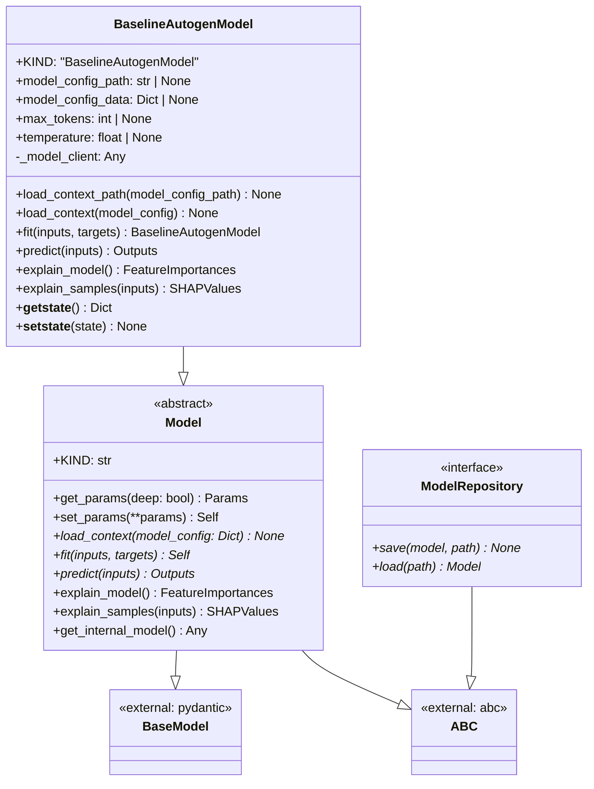
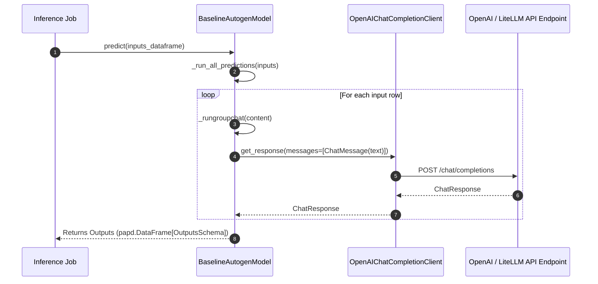

# Module Name: models

* **Source Directory Reference:** `src/autogen_team/models/`
* **Package Dependency:** Upstream: `agent_framework`, `pydantic`, `pandas`, `src/autogen_team/core/schemas.py`. Downstream: `src/autogen_team/application/jobs/`, `src/autogen_team/registry/`.

## 1. Executive Summary & Purpose

The `models` module encapsulates machine learning model implementations, decoupling application orchestration from specific LLM providers and frameworks. The core class `Model` establishes the unified contract for loading context (`load_context`), fitting (`fit`), predicting (`predict`), and model explainability (`explain_model`, `explain_samples`). `BaselineAutogenModel` implements this interface using `agent_framework.openai.OpenAIChatCompletionClient`.

## 2. UML 2.0 Class & Inheritance Architecture (Deterministic)

## 3. Package & Class Relations

* **Model Contract (`Model`):** Extends `pydantic.BaseModel` allowing parameters to be introspected via `get_params()` and updated via `set_params()` for scikit-learn API compatibility.
* **LLM Client Wrapping (`BaselineAutogenModel`):** Dynamically parses JSON model configurations, resolves nested environment variables (`${API_KEY}`), initializes the underlying `OpenAIChatCompletionClient` / `OpenAIChatClient`, and manages thread-safe async batch predictions via `asyncio.gather()`.
* **State Serialization:** Implements custom `__getstate__` and `__setstate__` to exclude unpicklable network clients during MLflow model artifact serialization while preserving Pydantic private attributes.

## 4. Execution Flow & Runtime Behavior

---

* **Source Citations:**
  * Abstract Model Class: `src/autogen_team/models/entities.py:33-130`
  * BaselineAutogenModel: `src/autogen_team/models/entities.py:132-411`
  * Model Repository Interface: `src/autogen_team/models/repositories.py:1-25`
