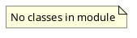

# Document: src/autogen_team/models/__init__.py

## Module Overview

Models Domain - ML model entities and repository.

### Purpose
Provides functionality for `__init__`.

### Responsibilities
Handles operations and definitions related to `__init__`.

### Main Workflow
Execution flow defined by the functions and classes in the module.

### Dependencies
- `entities.BaselineAutogenModel`
- `entities.Model`
- `entities.ModelKind`
- `entities.ParamKey`
- `entities.Params`
- `entities.ParamValue`

## Public API

### Exported Classes
None

### Exported Functions
None

## UML Diagram

