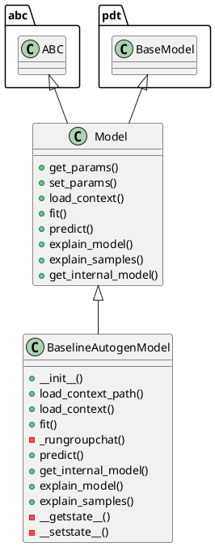

# Document: src/autogen_team/models/entities.py

## Module Overview

Define trainable machine learning models.

### Purpose
Provides functionality for `entities`.

### Responsibilities
Handles operations and definitions related to `entities`.

### Main Workflow
Execution flow defined by the functions and classes in the module.

### Dependencies
- `abc`
- `asyncio`
- `json`
- `os`
- `typing`
- `datetime.datetime`
- `datetime.timezone`
- `typing.Any`
- `typing.Dict`
- `typing.Optional`
- `pandas`
- `pydantic`
- `agent_framework.ChatResponse`
- `agent_framework.Message`
- `agent_framework.openai.OpenAIChatClient`
- `pydantic.Field`
- `pydantic.PrivateAttr`
- `autogen_team.core.schemas`

## Public API

### Exported Classes
- `Model`
- `BaselineAutogenModel`

### Exported Functions
None

## Class `Model`

### Overview

Base class for a project model.

Use a model to adapt AI/ML frameworks.
e.g., to swap easily one model with another.

### Attributes

- `KIND` (str): Public property.

### Public Method `get_params`

#### Description
Get the model params.

Args:
    deep (bool, optional): ignored.

Returns:
    Params: internal model parameters.

#### Inputs
- `deep` (bool): semantic meaning. Optional (default: `True`).

#### Output
- Return type: `Params`
- Semantic meaning: Result of the operation.

#### Side Effects
May update internal state or external services.

#### Complexity
- Time Complexity: O(1) mostly.
- Space Complexity: O(1) mostly.

#### Example
```python
# Example usage of get_params
instance.get_params()
```

### Public Method `set_params`

#### Description
Set the model params in place.

Returns:
    T.Self: instance of the model.

#### Inputs
None

#### Output
- Return type: `T.Self`
- Semantic meaning: Result of the operation.

#### Side Effects
May update internal state or external services.

#### Complexity
- Time Complexity: O(1) mostly.
- Space Complexity: O(1) mostly.

#### Example
```python
# Example usage of set_params
instance.set_params()
```

### Public Method `load_context`

#### Description
Load the model from the specified artifacts directory.

#### Inputs
- `model_config` (Dict[(str, Any)]): semantic meaning. Required.

#### Output
- Return type: `None`
- Semantic meaning: Result of the operation.

#### Side Effects
May update internal state or external services.

#### Complexity
- Time Complexity: O(1) mostly.
- Space Complexity: O(1) mostly.

#### Example
```python
# Example usage of load_context
instance.load_context()
```

### Public Method `fit`

#### Description
Fit the model on the given inputs and targets.

Args:
    inputs (schemas.Inputs): model training inputs.
    targets (schemas.Targets): model training targets.

Returns:
    T.Self: instance of the model.

#### Inputs
- `inputs` (schemas.Inputs): semantic meaning. Required.
- `targets` (schemas.Targets): semantic meaning. Required.

#### Output
- Return type: `T.Self`
- Semantic meaning: Result of the operation.

#### Side Effects
May update internal state or external services.

#### Complexity
- Time Complexity: O(1) mostly.
- Space Complexity: O(1) mostly.

#### Example
```python
# Example usage of fit
instance.fit()
```

### Public Method `predict`

#### Description
Generate outputs with the model for the given inputs.

Args:
    inputs (schemas.Inputs): model prediction inputs.

Returns:
    schemas.Outputs: model prediction outputs.

#### Inputs
- `inputs` (schemas.Inputs): semantic meaning. Required.

#### Output
- Return type: `schemas.Outputs`
- Semantic meaning: Result of the operation.

#### Side Effects
May update internal state or external services.

#### Complexity
- Time Complexity: O(1) mostly.
- Space Complexity: O(1) mostly.

#### Example
```python
# Example usage of predict
instance.predict()
```

### Public Method `explain_model`

#### Description
Explain the internal model structure.

Raises:
    NotImplementedError: method not implemented.

Returns:
    schemas.FeatureImportances: feature importances.

#### Inputs
None

#### Output
- Return type: `schemas.FeatureImportances`
- Semantic meaning: Result of the operation.

#### Side Effects
May update internal state or external services.

#### Complexity
- Time Complexity: O(1) mostly.
- Space Complexity: O(1) mostly.

#### Example
```python
# Example usage of explain_model
instance.explain_model()
```

### Public Method `explain_samples`

#### Description
Explain model outputs on input samples.

Raises:
    NotImplementedError: method not implemented.

Returns:
    schemas.SHAPValues: SHAP values.

#### Inputs
- `inputs` (schemas.Inputs): semantic meaning. Required.

#### Output
- Return type: `schemas.SHAPValues`
- Semantic meaning: Result of the operation.

#### Side Effects
May update internal state or external services.

#### Complexity
- Time Complexity: O(1) mostly.
- Space Complexity: O(1) mostly.

#### Example
```python
# Example usage of explain_samples
instance.explain_samples()
```

### Public Method `get_internal_model`

#### Description
Return the internal model in the object.

Raises:
    NotImplementedError: method not implemented.

Returns:
    T.Any: any internal model (either empty or fitted).

#### Inputs
None

#### Output
- Return type: `T.Any`
- Semantic meaning: Result of the operation.

#### Side Effects
May update internal state or external services.

#### Complexity
- Time Complexity: O(1) mostly.
- Space Complexity: O(1) mostly.

#### Example
```python
# Example usage of get_internal_model
instance.get_internal_model()
```

## Class `BaselineAutogenModel`

### Overview

Simple baseline model based on autogen.
https://microsoft.github.io/autogen/stable/user-guide/core-user-guide/design-patterns/group-chat.html
Parameters:
    max_tokens (int): maximum token of the prompt
    temperature (float): temperature for the sampling

### Attributes

- `KIND` (T.Literal[BaselineAutogenModel]): Public property.
- `model_config_path` (Optional[str]): Public property.
- `model_config_data` (Optional[Dict[(str, Any)]]): Public property.
- `max_tokens` (Optional[int]): Public property.
- `temperature` (Optional[float]): Public property.

### Constructor

No description provided.

**Parameters:**
- `model_config_path` (Optional[str]) = `None`
- `model_config_data` (Optional[Dict[(str, Any)]]) = `None`
- `max_tokens` (Optional[int]) = `320000`
- `temperature` (Optional[float]) = `0.5`

### Public Method `load_context_path`

#### Description
Load the model from the specified artifacts directory.

#### Inputs
- `model_config_path` (Optional[str]): semantic meaning. Optional (default: `None`).

#### Output
- Return type: `None`
- Semantic meaning: Result of the operation.

#### Side Effects
May update internal state or external services.

#### Complexity
- Time Complexity: O(1) mostly.
- Space Complexity: O(1) mostly.

#### Example
```python
# Example usage of load_context_path
instance.load_context_path()
```

### Public Method `load_context`

#### Description
Load the model from the specified artifacts directory.
https://microsoft.github.io/autogen/stable/user-guide/agentchat-user-guide/migration-guide.html#assistant-agent
https://microsoft.github.io/autogen/stable/user-guide/core-user-guide/cookbook/local-llms-ollama-litellm.html

#### Inputs
- `model_config` (Dict[(str, Any)]): semantic meaning. Required.

#### Output
- Return type: `None`
- Semantic meaning: Result of the operation.

#### Side Effects
May update internal state or external services.

#### Complexity
- Time Complexity: O(1) mostly.
- Space Complexity: O(1) mostly.

#### Example
```python
# Example usage of load_context
instance.load_context()
```

### Public Method `fit`

#### Description
No description provided.

#### Inputs
- `inputs` (schemas.Inputs): semantic meaning. Required.
- `targets` (schemas.Targets): semantic meaning. Required.

#### Output
- Return type: `BaselineAutogenModel`
- Semantic meaning: Result of the operation.

#### Side Effects
May update internal state or external services.

#### Complexity
- Time Complexity: O(1) mostly.
- Space Complexity: O(1) mostly.

#### Example
```python
# Example usage of fit
instance.fit()
```

### Private Method `_rungroupchat`

**Purpose:** Executes a group chat request using the model client.

**Parameters:**
- `content`: str

**Return value:**
- `ChatResponse`

### Public Method `predict`

#### Description
Predicts the output using the assistant team based on the given inputs.
Processes each input element concurrently and appends results to the output DataFrame.

#### Inputs
- `inputs` (schemas.Inputs): semantic meaning. Required.

#### Output
- Return type: `schemas.Outputs`
- Semantic meaning: Result of the operation.

#### Side Effects
May update internal state or external services.

#### Complexity
- Time Complexity: O(1) mostly.
- Space Complexity: O(1) mostly.

#### Example
```python
# Example usage of predict
instance.predict()
```

### Public Method `get_internal_model`

#### Description
No description provided.

#### Inputs
None

#### Output
- Return type: `Any`
- Semantic meaning: Result of the operation.

#### Side Effects
May update internal state or external services.

#### Complexity
- Time Complexity: O(1) mostly.
- Space Complexity: O(1) mostly.

#### Example
```python
# Example usage of get_internal_model
instance.get_internal_model()
```

### Public Method `explain_model`

#### Description
Provides a text-based explanation of the model's internal structure.
Since this model leverages the OpenAI Chat API for generating responses,
it does not produce traditional numerical feature importances.

#### Inputs
None

#### Output
- Return type: `schemas.FeatureImportances`
- Semantic meaning: Result of the operation.

#### Side Effects
May update internal state or external services.

#### Complexity
- Time Complexity: O(1) mostly.
- Space Complexity: O(1) mostly.

#### Example
```python
# Example usage of explain_model
instance.explain_model()
```

### Public Method `explain_samples`

#### Description
Explains model outputs for the given input samples by leveraging the predict function.
For each input, a textual explanation is provided along with a dummy SHAP value.

#### Inputs
- `inputs` (schemas.Inputs): semantic meaning. Required.

#### Output
- Return type: `schemas.SHAPValues`
- Semantic meaning: Result of the operation.

#### Side Effects
May update internal state or external services.

#### Complexity
- Time Complexity: O(1) mostly.
- Space Complexity: O(1) mostly.

#### Example
```python
# Example usage of explain_samples
instance.explain_samples()
```

### Private Method `__getstate__`

**Purpose:** Custom getstate to exclude unpicklable model client while preserving Pydantic state.

**Parameters:**

**Return value:**
- `Dict[(str, Any)]`

### Private Method `__setstate__`

**Purpose:** Custom setstate to restore the model state including Pydantic internal state.

**Parameters:**
- `state`: Dict[(str, Any)]

**Return value:**
- `None`

## UML Diagram



