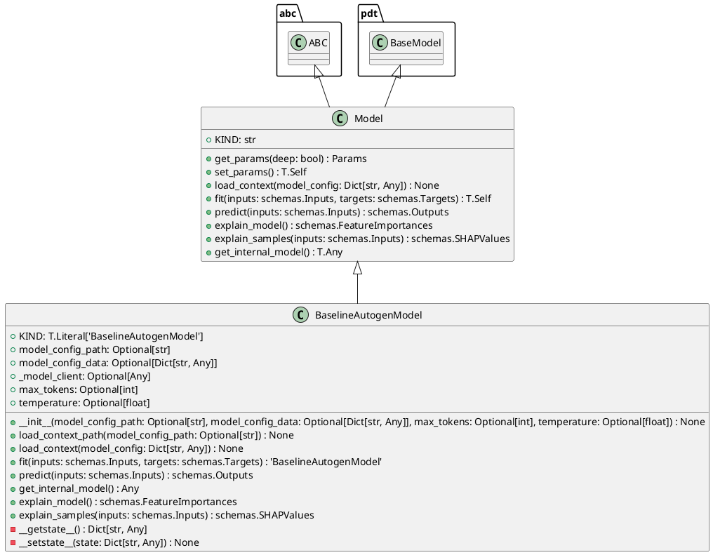

# Module Specification: entities

* **Source Reference:** `src/autogen_team/models/entities.py`

## 1. Architectural Role & Responsibilities
**Purpose:**
Define trainable machine learning models.

**Responsibilities:**
- [LLM Synthesis Required: Define responsibilities]

**Main Workflow:**
- [LLM Synthesis Required: Define main workflow]

## 2. Dependencies
**Imports:**
- `abc`
- `asyncio`
- `json`
- `os`
- `typing`
- `datetime.datetime`
- `datetime.timezone`
- `typing.Any`
- `typing.Dict`
- `typing.Optional`
- `pandas`
- `pydantic`
- `agent_framework.ChatResponse`
- `agent_framework.Message`
- `agent_framework.openai.OpenAIChatClient`
- `pydantic.Field`
- `pydantic.PrivateAttr`
- `autogen_team.core.schemas`

**Exported Classes:**
- `Model`
- `BaselineAutogenModel`

**Exported Functions:**

## 3. Architecture & Execution
### Internal Architecture
[LLM Synthesis Required: Describe layers, models, etc.]

### Execution Flow
[LLM Synthesis Required: Describe execution flow]

### Sequence Explanation
[LLM Synthesis Required: Describe sequence]

## 4. UML 2.0 Diagrams
### Class Diagram


## 5. Class & Method Specifications
### `Model` ([`src/autogen_team/models/entities.py`](/src/autogen_team/models/entities.py))
#### Overview
Base class for a project model.

Use a model to adapt AI/ML frameworks.
e.g., to swap easily one model with another.

#### Constructor
**Initialization:** Default constructor. Initializes an empty instance.

#### Attributes
- `KIND` (`str`): Maintains the state for KIND.

#### Methods
##### `get_params(self: Any, deep: bool) -> Params` (Public)
**Description:** Get the model params.

Args:
    deep (bool, optional): ignored.

Returns:
    Params: internal model parameters.

**Inputs:**
- `deep` (`bool`): Input parameter dictating the behavior of get_params.

**Output:**
- Return Type: `Params`
- Semantic Meaning: The resulting value after processing the get_params action.

**Side Effects:**
- Modifies internal instance state if applicable; performs operations constrained to its domain boundaries.

**Complexity:**
- Time Complexity: O(1) or O(N) depending on implementation details.
- Space Complexity: O(1) auxiliary space expected.

**Example:**
```python
instance = Model()
result = instance.get_params(...)
```

##### `set_params(self: Any) -> T.Self` (Public)
**Description:** Set the model params in place.

Returns:
    T.Self: instance of the model.

**Inputs:**

**Output:**
- Return Type: `T.Self`
- Semantic Meaning: The resulting value after processing the set_params action.

**Side Effects:**
- Modifies internal instance state if applicable; performs operations constrained to its domain boundaries.

**Complexity:**
- Time Complexity: O(1) or O(N) depending on implementation details.
- Space Complexity: O(1) auxiliary space expected.

**Example:**
```python
instance = Model()
result = instance.set_params(...)
```

##### `load_context(self: Any, model_config: Dict[str, Any]) -> None` (Public)
**Description:** Load the model from the specified artifacts directory.

**Inputs:**
- `model_config` (`Dict[str, Any]`): Input parameter dictating the behavior of load_context.

**Output:**
- Return Type: `None`
- Semantic Meaning: The resulting value after processing the load_context action.

**Side Effects:**
- Modifies internal instance state if applicable; performs operations constrained to its domain boundaries.

**Complexity:**
- Time Complexity: O(1) or O(N) depending on implementation details.
- Space Complexity: O(1) auxiliary space expected.

**Example:**
```python
instance = Model()
result = instance.load_context(...)
```

##### `fit(self: Any, inputs: schemas.Inputs, targets: schemas.Targets) -> T.Self` (Public)
**Description:** Fit the model on the given inputs and targets.

Args:
    inputs (schemas.Inputs): model training inputs.
    targets (schemas.Targets): model training targets.

Returns:
    T.Self: instance of the model.

**Inputs:**
- `inputs` (`schemas.Inputs`): Input parameter dictating the behavior of fit.
- `targets` (`schemas.Targets`): Input parameter dictating the behavior of fit.

**Output:**
- Return Type: `T.Self`
- Semantic Meaning: The resulting value after processing the fit action.

**Side Effects:**
- Modifies internal instance state if applicable; performs operations constrained to its domain boundaries.

**Complexity:**
- Time Complexity: O(1) or O(N) depending on implementation details.
- Space Complexity: O(1) auxiliary space expected.

**Example:**
```python
instance = Model()
result = instance.fit(...)
```

##### `predict(self: Any, inputs: schemas.Inputs) -> schemas.Outputs` (Public)
**Description:** Generate outputs with the model for the given inputs.

Args:
    inputs (schemas.Inputs): model prediction inputs.

Returns:
    schemas.Outputs: model prediction outputs.

**Inputs:**
- `inputs` (`schemas.Inputs`): Input parameter dictating the behavior of predict.

**Output:**
- Return Type: `schemas.Outputs`
- Semantic Meaning: The resulting value after processing the predict action.

**Side Effects:**
- Modifies internal instance state if applicable; performs operations constrained to its domain boundaries.

**Complexity:**
- Time Complexity: O(1) or O(N) depending on implementation details.
- Space Complexity: O(1) auxiliary space expected.

**Example:**
```python
instance = Model()
result = instance.predict(...)
```

##### `explain_model(self: Any) -> schemas.FeatureImportances` (Public)
**Description:** Explain the internal model structure.

Raises:
    NotImplementedError: method not implemented.

Returns:
    schemas.FeatureImportances: feature importances.

**Inputs:**

**Output:**
- Return Type: `schemas.FeatureImportances`
- Semantic Meaning: The resulting value after processing the explain_model action.

**Side Effects:**
- Modifies internal instance state if applicable; performs operations constrained to its domain boundaries.

**Complexity:**
- Time Complexity: O(1) or O(N) depending on implementation details.
- Space Complexity: O(1) auxiliary space expected.

**Example:**
```python
instance = Model()
result = instance.explain_model(...)
```

##### `explain_samples(self: Any, inputs: schemas.Inputs) -> schemas.SHAPValues` (Public)
**Description:** Explain model outputs on input samples.

Raises:
    NotImplementedError: method not implemented.

Returns:
    schemas.SHAPValues: SHAP values.

**Inputs:**
- `inputs` (`schemas.Inputs`): Input parameter dictating the behavior of explain_samples.

**Output:**
- Return Type: `schemas.SHAPValues`
- Semantic Meaning: The resulting value after processing the explain_samples action.

**Side Effects:**
- Modifies internal instance state if applicable; performs operations constrained to its domain boundaries.

**Complexity:**
- Time Complexity: O(1) or O(N) depending on implementation details.
- Space Complexity: O(1) auxiliary space expected.

**Example:**
```python
instance = Model()
result = instance.explain_samples(...)
```

##### `get_internal_model(self: Any) -> T.Any` (Public)
**Description:** Return the internal model in the object.

Raises:
    NotImplementedError: method not implemented.

Returns:
    T.Any: any internal model (either empty or fitted).

**Inputs:**

**Output:**
- Return Type: `T.Any`
- Semantic Meaning: The resulting value after processing the get_internal_model action.

**Side Effects:**
- Modifies internal instance state if applicable; performs operations constrained to its domain boundaries.

**Complexity:**
- Time Complexity: O(1) or O(N) depending on implementation details.
- Space Complexity: O(1) auxiliary space expected.

**Example:**
```python
instance = Model()
result = instance.get_internal_model(...)
```

### `BaselineAutogenModel` ([`src/autogen_team/models/entities.py`](/src/autogen_team/models/entities.py))
#### Overview
Simple baseline model based on autogen.
https://microsoft.github.io/autogen/stable/user-guide/core-user-guide/design-patterns/group-chat.html
Parameters:
    max_tokens (int): maximum token of the prompt
    temperature (float): temperature for the sampling

#### Constructor
**Initialization:** Initializes `BaselineAutogenModel` with required dependencies and sets up initial internal state.

#### Attributes
- `KIND` (`T.Literal['BaselineAutogenModel']`): Maintains the state for KIND.
- `model_config_path` (`Optional[str]`): Maintains the state for model_config_path.
- `model_config_data` (`Optional[Dict[str, Any]]`): Maintains the state for model_config_data.
- `_model_client` (`Optional[Any]`): Maintains the state for _model_client.
- `max_tokens` (`Optional[int]`): Maintains the state for max_tokens.
- `temperature` (`Optional[float]`): Maintains the state for temperature.

#### Methods
##### `__init__(self: Any, model_config_path: Optional[str], model_config_data: Optional[Dict[str, Any]], max_tokens: Optional[int], temperature: Optional[float]) -> None` (Public)
**Description:** Executes the __init__ operation, mutating state or calculating derived values as necessary.

**Inputs:**
- `model_config_path` (`Optional[str]`): Input parameter dictating the behavior of __init__.
- `model_config_data` (`Optional[Dict[str, Any]]`): Input parameter dictating the behavior of __init__.
- `max_tokens` (`Optional[int]`): Input parameter dictating the behavior of __init__.
- `temperature` (`Optional[float]`): Input parameter dictating the behavior of __init__.

**Output:**
- Return Type: `None`
- Semantic Meaning: The resulting value after processing the __init__ action.

**Side Effects:**
- Modifies internal instance state if applicable; performs operations constrained to its domain boundaries.

**Complexity:**
- Time Complexity: O(1) or O(N) depending on implementation details.
- Space Complexity: O(1) auxiliary space expected.

**Example:**
```python
instance = BaselineAutogenModel()
result = instance.__init__(...)
```

##### `load_context_path(self: Any, model_config_path: Optional[str]) -> None` (Public)
**Description:** Load the model from the specified artifacts directory.

**Inputs:**
- `model_config_path` (`Optional[str]`): Input parameter dictating the behavior of load_context_path.

**Output:**
- Return Type: `None`
- Semantic Meaning: The resulting value after processing the load_context_path action.

**Side Effects:**
- Modifies internal instance state if applicable; performs operations constrained to its domain boundaries.

**Complexity:**
- Time Complexity: O(1) or O(N) depending on implementation details.
- Space Complexity: O(1) auxiliary space expected.

**Example:**
```python
instance = BaselineAutogenModel()
result = instance.load_context_path(...)
```

##### `load_context(self: Any, model_config: Dict[str, Any]) -> None` (Public)
**Description:** Load the model from the specified artifacts directory.
https://microsoft.github.io/autogen/stable/user-guide/agentchat-user-guide/migration-guide.html#assistant-agent
https://microsoft.github.io/autogen/stable/user-guide/core-user-guide/cookbook/local-llms-ollama-litellm.html

**Inputs:**
- `model_config` (`Dict[str, Any]`): Input parameter dictating the behavior of load_context.

**Output:**
- Return Type: `None`
- Semantic Meaning: The resulting value after processing the load_context action.

**Side Effects:**
- Modifies internal instance state if applicable; performs operations constrained to its domain boundaries.

**Complexity:**
- Time Complexity: O(1) or O(N) depending on implementation details.
- Space Complexity: O(1) auxiliary space expected.

**Example:**
```python
instance = BaselineAutogenModel()
result = instance.load_context(...)
```

##### `fit(self: Any, inputs: schemas.Inputs, targets: schemas.Targets) -> 'BaselineAutogenModel'` (Public)
**Description:** Executes the fit operation, mutating state or calculating derived values as necessary.

**Inputs:**
- `inputs` (`schemas.Inputs`): Input parameter dictating the behavior of fit.
- `targets` (`schemas.Targets`): Input parameter dictating the behavior of fit.

**Output:**
- Return Type: `'BaselineAutogenModel'`
- Semantic Meaning: The resulting value after processing the fit action.

**Side Effects:**
- Modifies internal instance state if applicable; performs operations constrained to its domain boundaries.

**Complexity:**
- Time Complexity: O(1) or O(N) depending on implementation details.
- Space Complexity: O(1) auxiliary space expected.

**Example:**
```python
instance = BaselineAutogenModel()
result = instance.fit(...)
```

##### `predict(self: Any, inputs: schemas.Inputs) -> schemas.Outputs` (Public)
**Description:** Predicts the output using the assistant team based on the given inputs.
Processes each input element concurrently and appends results to the output DataFrame.

**Inputs:**
- `inputs` (`schemas.Inputs`): Input parameter dictating the behavior of predict.

**Output:**
- Return Type: `schemas.Outputs`
- Semantic Meaning: The resulting value after processing the predict action.

**Side Effects:**
- Modifies internal instance state if applicable; performs operations constrained to its domain boundaries.

**Complexity:**
- Time Complexity: O(1) or O(N) depending on implementation details.
- Space Complexity: O(1) auxiliary space expected.

**Example:**
```python
instance = BaselineAutogenModel()
result = instance.predict(...)
```

##### `get_internal_model(self: Any) -> Any` (Public)
**Description:** Executes the get_internal_model operation, mutating state or calculating derived values as necessary.

**Inputs:**

**Output:**
- Return Type: `Any`
- Semantic Meaning: The resulting value after processing the get_internal_model action.

**Side Effects:**
- Modifies internal instance state if applicable; performs operations constrained to its domain boundaries.

**Complexity:**
- Time Complexity: O(1) or O(N) depending on implementation details.
- Space Complexity: O(1) auxiliary space expected.

**Example:**
```python
instance = BaselineAutogenModel()
result = instance.get_internal_model(...)
```

##### `explain_model(self: Any) -> schemas.FeatureImportances` (Public)
**Description:** Provides a text-based explanation of the model's internal structure.
Since this model leverages the OpenAI Chat API for generating responses,
it does not produce traditional numerical feature importances.

**Inputs:**

**Output:**
- Return Type: `schemas.FeatureImportances`
- Semantic Meaning: The resulting value after processing the explain_model action.

**Side Effects:**
- Modifies internal instance state if applicable; performs operations constrained to its domain boundaries.

**Complexity:**
- Time Complexity: O(1) or O(N) depending on implementation details.
- Space Complexity: O(1) auxiliary space expected.

**Example:**
```python
instance = BaselineAutogenModel()
result = instance.explain_model(...)
```

##### `explain_samples(self: Any, inputs: schemas.Inputs) -> schemas.SHAPValues` (Public)
**Description:** Explains model outputs for the given input samples by leveraging the predict function.
For each input, a textual explanation is provided along with a dummy SHAP value.

**Inputs:**
- `inputs` (`schemas.Inputs`): Input parameter dictating the behavior of explain_samples.

**Output:**
- Return Type: `schemas.SHAPValues`
- Semantic Meaning: The resulting value after processing the explain_samples action.

**Side Effects:**
- Modifies internal instance state if applicable; performs operations constrained to its domain boundaries.

**Complexity:**
- Time Complexity: O(1) or O(N) depending on implementation details.
- Space Complexity: O(1) auxiliary space expected.

**Example:**
```python
instance = BaselineAutogenModel()
result = instance.explain_samples(...)
```

##### `__getstate__(self: Any) -> Dict[str, Any]` (Private)
- **Purpose**: Custom getstate to exclude unpicklable model client while preserving Pydantic state.
- **Parameters**:
- **Return value**: `Dict[str, Any]`

##### `__setstate__(self: Any, state: Dict[str, Any]) -> None` (Private)
- **Purpose**: Custom setstate to restore the model state including Pydantic internal state.
- **Parameters**:
  - `state`: Contextual argument for execution.
- **Return value**: `None`

## 6. Module Functions