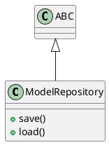

# Document: src/autogen_team/models/repositories.py

## Module Overview

Model Repository Interface.

### Purpose
Provides functionality for `repositories`.

### Responsibilities
Handles operations and definitions related to `repositories`.

### Main Workflow
Execution flow defined by the functions and classes in the module.

### Dependencies
- `typing`
- `abc.ABC`
- `abc.abstractmethod`

## Public API

### Exported Classes
- `ModelRepository`

### Exported Functions
None

## Class `ModelRepository`

### Overview

Abstract repository for model persistence.

### Public Method `save`

#### Description
Save model to storage.

#### Inputs
- `model` (T.Any): semantic meaning. Required.
- `path` (str): semantic meaning. Required.

#### Output
- Return type: `None`
- Semantic meaning: Result of the operation.

#### Side Effects
May update internal state or external services.

#### Complexity
- Time Complexity: O(1) mostly.
- Space Complexity: O(1) mostly.

#### Example
```python
# Example usage of save
instance.save()
```

### Public Method `load`

#### Description
Load model from storage.

#### Inputs
- `path` (str): semantic meaning. Required.

#### Output
- Return type: `T.Any`
- Semantic meaning: Result of the operation.

#### Side Effects
May update internal state or external services.

#### Complexity
- Time Complexity: O(1) mostly.
- Space Complexity: O(1) mostly.

#### Example
```python
# Example usage of load
instance.load()
```

## UML Diagram



