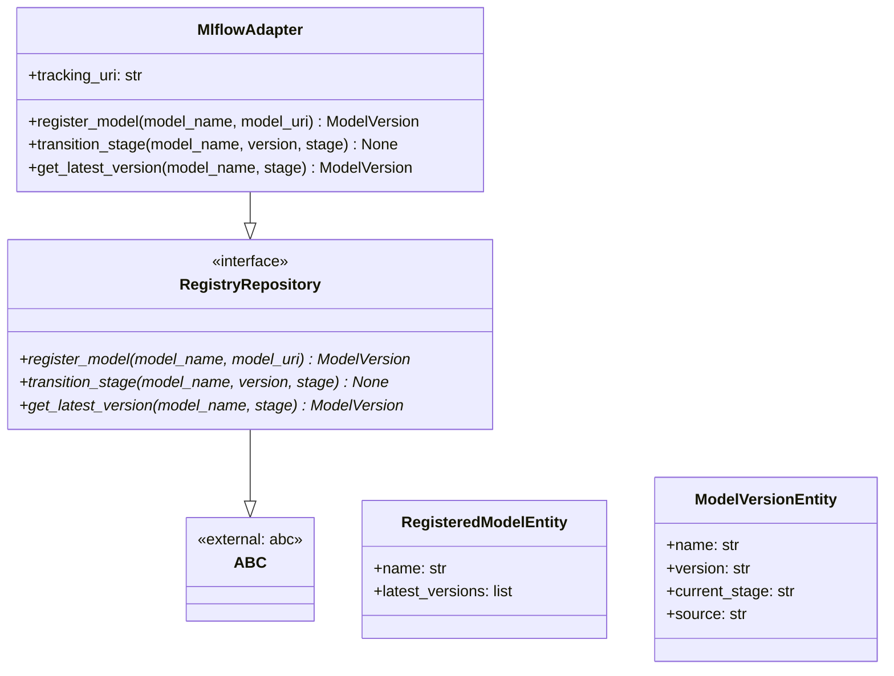
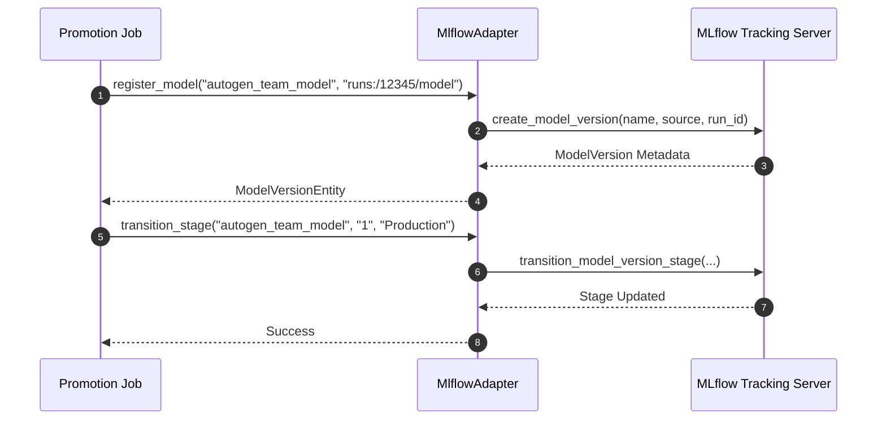

# Module Name: registry

* **Source Directory Reference:** `src/autogen_team/registry/`
* **Package Dependency:** Upstream: `mlflow`, `pydantic`, `src/autogen_team/models/`. Downstream: `src/autogen_team/application/jobs/promotion.py`, `src/autogen_team/infrastructure/services/mlflow_service.py`.

## 1. Executive Summary & Purpose

The `registry` module manages model versioning, artifact registration, run metadata logging, and stage transitions (Staging, Production, Archived). It defines `RegistryRepository` interface, `MlflowAdapter` implementation, and entity representations for model metadata.

## 2. UML 2.0 Class & Inheritance Architecture (Deterministic)

## 3. Package & Class Relations

* **Registry Abstraction (`RegistryRepository`):** Provides model registration APIs decoupled from the specific underlying registry provider.
* **MLflow Integration (`MlflowAdapter`):** Interacts with MLflow Tracking Server (`mlflow.tracking.MlflowClient`) to register trained models, tag run artifacts, promote models to Production, and retrieve staged versions.

## 4. Execution Flow & Runtime Behavior

---

* **Source Citations:**
  * Registry Repository Interface: `src/autogen_team/registry/repositories.py:1-25`
  * MLflow Adapter Implementation: `src/autogen_team/registry/adapters/mlflow_adapter.py:1-40`
  * Registry Entities: `src/autogen_team/registry/entities.py:1-30`
