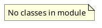

# Document: src/autogen_team/registry/__init__.py

## Module Overview

Registry Domain - Model registration and versioning.

### Purpose
Provides functionality for `__init__`.

### Responsibilities
Handles operations and definitions related to `__init__`.

### Main Workflow
Execution flow defined by the functions and classes in the module.

### Dependencies
- `entities.ModelInfo`
- `entities.ModelVersion`
- `repositories.RegistryRepository`

## Public API

### Exported Classes
None

### Exported Functions
None

## UML Diagram

