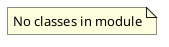

# Document: src/autogen_team/registry/adapters/__init__.py

## Module Overview

Registry Adapters.

### Purpose
Provides functionality for `__init__`.

### Responsibilities
Handles operations and definitions related to `__init__`.

### Main Workflow
Execution flow defined by the functions and classes in the module.

### Dependencies
- `mlflow_adapter.Alias`
- `mlflow_adapter.CustomLoader`
- `mlflow_adapter.CustomSaver`
- `mlflow_adapter.Info`
- `mlflow_adapter.Loader`
- `mlflow_adapter.LoaderKind`
- `mlflow_adapter.MlflowRegister`
- `mlflow_adapter.Register`
- `mlflow_adapter.RegisterKind`
- `mlflow_adapter.Saver`
- `mlflow_adapter.SaverKind`
- `mlflow_adapter.Version`
- `mlflow_adapter.uri_for_model_alias`
- `mlflow_adapter.uri_for_model_alias_or_version`
- `mlflow_adapter.uri_for_model_version`

## Public API

### Exported Classes
None

### Exported Functions
None

## UML Diagram

