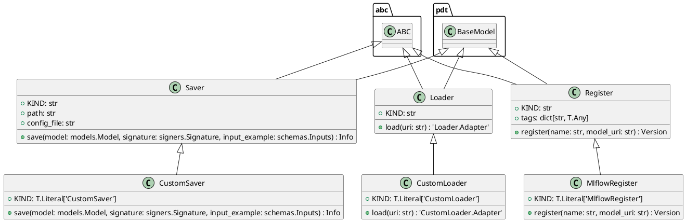

# Module Specification: mlflow_adapter

* **Source Reference:** `src/autogen_team/registry/adapters/mlflow_adapter.py`

## 1. Architectural Role & Responsibilities
**Purpose:**
Savers, loaders, and registers for model registries.

**Responsibilities:**
- [LLM Synthesis Required: Define responsibilities]

**Main Workflow:**
- [LLM Synthesis Required: Define main workflow]

## 2. Dependencies
**Imports:**
- `abc`
- `json`
- `os`
- `typing`
- `typing.Any`
- `typing.Dict`
- `mlflow`
- `mlflow.entities`
- `mlflow.entities.model_registry`
- `mlflow.models.model`
- `pandas`
- `pydantic`
- `mlflow.pyfunc.model.PythonModel`
- `mlflow.pyfunc.model.PythonModelContext`
- `autogen_team.core.schemas`
- `autogen_team.infrastructure.utils.signers`
- `autogen_team.models.entities`

**Exported Classes:**
- `Saver`
- `CustomSaver`
- `Loader`
- `CustomLoader`
- `Register`
- `MlflowRegister`

**Exported Functions:**
- `uri_for_model_alias`
- `uri_for_model_version`
- `uri_for_model_alias_or_version`

## 3. Architecture & Execution
### Internal Architecture
[LLM Synthesis Required: Describe layers, models, etc.]

### Execution Flow
[LLM Synthesis Required: Describe execution flow]

### Sequence Explanation
[LLM Synthesis Required: Describe sequence]

## 4. UML 2.0 Diagrams
### Class Diagram


## 5. Class & Method Specifications
### `Saver` ([`src/autogen_team/registry/adapters/mlflow_adapter.py`](/src/autogen_team/registry/adapters/mlflow_adapter.py))
#### Overview
Base class for saving models in registry.

Separate model definition from serialization.
e.g., to switch between serialization flavors.

Parameters:
    path (str): model path inside the Mlflow store.

#### Constructor
**Initialization:** Default constructor. Initializes an empty instance.

#### Attributes
- `KIND` (`str`): Maintains the state for KIND.
- `path` (`str`): Maintains the state for path.
- `config_file` (`str`): Maintains the state for config_file.

#### Methods
##### `save(self: Any, model: models.Model, signature: signers.Signature, input_example: schemas.Inputs) -> Info` (Public)
**Description:** Save a model in the model registry.

Args:
    model (models.Model): project model to save.
    signature (signers.Signature): model signature.
    input_example (schemas.Inputs): sample of inputs.

Returns:
    Info: model saving information.

**Inputs:**
- `model` (`models.Model`): Input parameter dictating the behavior of save.
- `signature` (`signers.Signature`): Input parameter dictating the behavior of save.
- `input_example` (`schemas.Inputs`): Input parameter dictating the behavior of save.

**Output:**
- Return Type: `Info`
- Semantic Meaning: The resulting value after processing the save action.

**Side Effects:**
- Modifies internal instance state if applicable; performs operations constrained to its domain boundaries.

**Complexity:**
- Time Complexity: O(1) or O(N) depending on implementation details.
- Space Complexity: O(1) auxiliary space expected.

**Example:**
```python
instance = Saver()
result = instance.save(...)
```

### `CustomSaver` ([`src/autogen_team/registry/adapters/mlflow_adapter.py`](/src/autogen_team/registry/adapters/mlflow_adapter.py))
#### Overview
Saver for project models using the Mlflow PyFunc module.

https://mlflow.org/docs/latest/python_api/mlflow.pyfunc.html
https://mlflow.org/blog/autogen-image-agent
https://mlflow.org/blog/custom-pyfunc

#### Constructor
**Initialization:** Default constructor. Initializes an empty instance.

#### Attributes
- `KIND` (`T.Literal['CustomSaver']`): Maintains the state for KIND.

#### Methods
##### `save(self: Any, model: models.Model, signature: signers.Signature, input_example: schemas.Inputs) -> Info` (Public)
**Description:** Executes the save operation, mutating state or calculating derived values as necessary.

**Inputs:**
- `model` (`models.Model`): Input parameter dictating the behavior of save.
- `signature` (`signers.Signature`): Input parameter dictating the behavior of save.
- `input_example` (`schemas.Inputs`): Input parameter dictating the behavior of save.

**Output:**
- Return Type: `Info`
- Semantic Meaning: The resulting value after processing the save action.

**Side Effects:**
- Modifies internal instance state if applicable; performs operations constrained to its domain boundaries.

**Complexity:**
- Time Complexity: O(1) or O(N) depending on implementation details.
- Space Complexity: O(1) auxiliary space expected.

**Example:**
```python
instance = CustomSaver()
result = instance.save(...)
```

### `Loader` ([`src/autogen_team/registry/adapters/mlflow_adapter.py`](/src/autogen_team/registry/adapters/mlflow_adapter.py))
#### Overview
Base class for loading models from registry.

Separate model definition from deserialization.
e.g., to switch between deserialization flavors.

#### Constructor
**Initialization:** Default constructor. Initializes an empty instance.

#### Attributes
- `KIND` (`str`): Maintains the state for KIND.

#### Methods
##### `load(self: Any, uri: str) -> 'Loader.Adapter'` (Public)
**Description:** Load a model from the model registry.

Args:
    uri (str): URI of a model to load.

Returns:
    Loader.Adapter: model loaded.

**Inputs:**
- `uri` (`str`): Input parameter dictating the behavior of load.

**Output:**
- Return Type: `'Loader.Adapter'`
- Semantic Meaning: The resulting value after processing the load action.

**Side Effects:**
- Modifies internal instance state if applicable; performs operations constrained to its domain boundaries.

**Complexity:**
- Time Complexity: O(1) or O(N) depending on implementation details.
- Space Complexity: O(1) auxiliary space expected.

**Example:**
```python
instance = Loader()
result = instance.load(...)
```

### `CustomLoader` ([`src/autogen_team/registry/adapters/mlflow_adapter.py`](/src/autogen_team/registry/adapters/mlflow_adapter.py))
#### Overview
Loader for custom models using the Mlflow PyFunc module.

https://mlflow.org/docs/latest/python_api/mlflow.pyfunc.html

#### Constructor
**Initialization:** Default constructor. Initializes an empty instance.

#### Attributes
- `KIND` (`T.Literal['CustomLoader']`): Maintains the state for KIND.

#### Methods
##### `load(self: Any, uri: str) -> 'CustomLoader.Adapter'` (Public)
**Description:** Executes the load operation, mutating state or calculating derived values as necessary.

**Inputs:**
- `uri` (`str`): Input parameter dictating the behavior of load.

**Output:**
- Return Type: `'CustomLoader.Adapter'`
- Semantic Meaning: The resulting value after processing the load action.

**Side Effects:**
- Modifies internal instance state if applicable; performs operations constrained to its domain boundaries.

**Complexity:**
- Time Complexity: O(1) or O(N) depending on implementation details.
- Space Complexity: O(1) auxiliary space expected.

**Example:**
```python
instance = CustomLoader()
result = instance.load(...)
```

### `Register` ([`src/autogen_team/registry/adapters/mlflow_adapter.py`](/src/autogen_team/registry/adapters/mlflow_adapter.py))
#### Overview
Base class for registring models to a location.

Separate model definition from its registration.
e.g., to change the model registry backend.

Parameters:
    tags (dict[str, T.Any]): tags for the model.

#### Constructor
**Initialization:** Default constructor. Initializes an empty instance.

#### Attributes
- `KIND` (`str`): Maintains the state for KIND.
- `tags` (`dict[str, T.Any]`): Maintains the state for tags.

#### Methods
##### `register(self: Any, name: str, model_uri: str) -> Version` (Public)
**Description:** Register a model given its name and URI.

Args:
    name (str): name of the model to register.
    model_uri (str): URI of a model to register.

Returns:
    Version: information about the registered model.

**Inputs:**
- `name` (`str`): Input parameter dictating the behavior of register.
- `model_uri` (`str`): Input parameter dictating the behavior of register.

**Output:**
- Return Type: `Version`
- Semantic Meaning: The resulting value after processing the register action.

**Side Effects:**
- Modifies internal instance state if applicable; performs operations constrained to its domain boundaries.

**Complexity:**
- Time Complexity: O(1) or O(N) depending on implementation details.
- Space Complexity: O(1) auxiliary space expected.

**Example:**
```python
instance = Register()
result = instance.register(...)
```

### `MlflowRegister` ([`src/autogen_team/registry/adapters/mlflow_adapter.py`](/src/autogen_team/registry/adapters/mlflow_adapter.py))
#### Overview
Register for models in the Mlflow Model Registry.

https://mlflow.org/docs/latest/model-registry.html

#### Constructor
**Initialization:** Default constructor. Initializes an empty instance.

#### Attributes
- `KIND` (`T.Literal['MlflowRegister']`): Maintains the state for KIND.

#### Methods
##### `register(self: Any, name: str, model_uri: str) -> Version` (Public)
**Description:** Executes the register operation, mutating state or calculating derived values as necessary.

**Inputs:**
- `name` (`str`): Input parameter dictating the behavior of register.
- `model_uri` (`str`): Input parameter dictating the behavior of register.

**Output:**
- Return Type: `Version`
- Semantic Meaning: The resulting value after processing the register action.

**Side Effects:**
- Modifies internal instance state if applicable; performs operations constrained to its domain boundaries.

**Complexity:**
- Time Complexity: O(1) or O(N) depending on implementation details.
- Space Complexity: O(1) auxiliary space expected.

**Example:**
```python
instance = MlflowRegister()
result = instance.register(...)
```

## 6. Module Functions
### `uri_for_model_alias(name: str, alias: str) -> str`
**Description:** Create a model URI from a model name and an alias.

Args:
    name (str): name of the mlflow registered model.
    alias (str): alias of the registered model.

Returns:
    str: model URI as "models:/name@alias".

**Inputs:**
- `name` (`str`): Standard input parameter for uri_for_model_alias.
- `alias` (`str`): Standard input parameter for uri_for_model_alias.

**Output:**
- Return Type: `str`

**Side Effects:**
- Operations execute statelessly or affect module-level configuration.

**Example:**
```python
result = uri_for_model_alias(...)
```

### `uri_for_model_version(name: str, version: str) -> str`
**Description:** Create a model URI from a model name and a version.

Args:
    name (str): name of the mlflow registered model.
    version (int): version of the registered model.

Returns:
    str: model URI as "models:/name/version."

**Inputs:**
- `name` (`str`): Standard input parameter for uri_for_model_version.
- `version` (`str`): Standard input parameter for uri_for_model_version.

**Output:**
- Return Type: `str`

**Side Effects:**
- Operations execute statelessly or affect module-level configuration.

**Example:**
```python
result = uri_for_model_version(...)
```

### `uri_for_model_alias_or_version(name: str, alias_or_version: str | int) -> str`
**Description:** Create a model URi from a model name and an alias or version.

Args:
    name (str): name of the mlflow registered model.
    alias_or_version (str | int): alias or version of the registered model.

Returns:
    str: model URI as "models:/name@alias" or "models:/name/version" based on input.

**Inputs:**
- `name` (`str`): Standard input parameter for uri_for_model_alias_or_version.
- `alias_or_version` (`str | int`): Standard input parameter for uri_for_model_alias_or_version.

**Output:**
- Return Type: `str`

**Side Effects:**
- Operations execute statelessly or affect module-level configuration.

**Example:**
```python
result = uri_for_model_alias_or_version(...)
```
