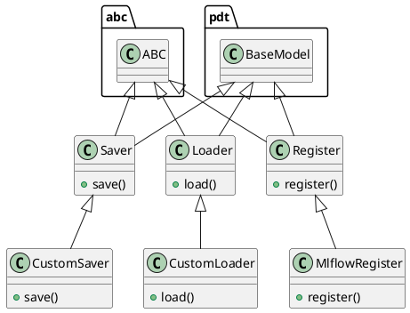

# Document: src/autogen_team/registry/adapters/mlflow_adapter.py

## Module Overview

Savers, loaders, and registers for model registries.

### Purpose
Provides functionality for `mlflow_adapter`.

### Responsibilities
Handles operations and definitions related to `mlflow_adapter`.

### Main Workflow
Execution flow defined by the functions and classes in the module.

### Dependencies
- `abc`
- `json`
- `os`
- `typing`
- `typing.Any`
- `typing.Dict`
- `mlflow`
- `mlflow.entities`
- `mlflow.entities.model_registry`
- `mlflow.models.model`
- `pandas`
- `pydantic`
- `mlflow.pyfunc.model.PythonModel`
- `mlflow.pyfunc.model.PythonModelContext`
- `autogen_team.core.schemas`
- `autogen_team.infrastructure.utils.signers`
- `autogen_team.models.entities`

## Public API

### Exported Classes
- `Saver`
- `CustomSaver`
- `Loader`
- `CustomLoader`
- `Register`
- `MlflowRegister`

### Exported Functions
- `uri_for_model_alias`
- `uri_for_model_version`
- `uri_for_model_alias_or_version`

## Class `Saver`

### Overview

Base class for saving models in registry.

Separate model definition from serialization.
e.g., to switch between serialization flavors.

Parameters:
    path (str): model path inside the Mlflow store.

### Attributes

- `KIND` (str): Public property.
- `path` (str): Public property.
- `config_file` (str): Public property.

### Public Method `save`

#### Description
Save a model in the model registry.

Args:
    model (models.Model): project model to save.
    signature (signers.Signature): model signature.
    input_example (schemas.Inputs): sample of inputs.

Returns:
    Info: model saving information.

#### Inputs
- `model` (models.Model): semantic meaning. Required.
- `signature` (signers.Signature): semantic meaning. Required.
- `input_example` (schemas.Inputs): semantic meaning. Required.

#### Output
- Return type: `Info`
- Semantic meaning: Result of the operation.

#### Side Effects
May update internal state or external services.

#### Complexity
- Time Complexity: O(1) mostly.
- Space Complexity: O(1) mostly.

#### Example
```python
# Example usage of save
instance.save()
```

## Class `CustomSaver`

### Overview

Saver for project models using the Mlflow PyFunc module.

https://mlflow.org/docs/latest/python_api/mlflow.pyfunc.html
https://mlflow.org/blog/autogen-image-agent
https://mlflow.org/blog/custom-pyfunc

### Attributes

- `KIND` (T.Literal[CustomSaver]): Public property.

### Public Method `save`

#### Description
No description provided.

#### Inputs
- `model` (models.Model): semantic meaning. Required.
- `signature` (signers.Signature): semantic meaning. Required.
- `input_example` (schemas.Inputs): semantic meaning. Required.

#### Output
- Return type: `Info`
- Semantic meaning: Result of the operation.

#### Side Effects
May update internal state or external services.

#### Complexity
- Time Complexity: O(1) mostly.
- Space Complexity: O(1) mostly.

#### Example
```python
# Example usage of save
instance.save()
```

## Class `Loader`

### Overview

Base class for loading models from registry.

Separate model definition from deserialization.
e.g., to switch between deserialization flavors.

### Attributes

- `KIND` (str): Public property.

### Public Method `load`

#### Description
Load a model from the model registry.

Args:
    uri (str): URI of a model to load.

Returns:
    Loader.Adapter: model loaded.

#### Inputs
- `uri` (str): semantic meaning. Required.

#### Output
- Return type: `Loader.Adapter`
- Semantic meaning: Result of the operation.

#### Side Effects
May update internal state or external services.

#### Complexity
- Time Complexity: O(1) mostly.
- Space Complexity: O(1) mostly.

#### Example
```python
# Example usage of load
instance.load()
```

## Class `CustomLoader`

### Overview

Loader for custom models using the Mlflow PyFunc module.

https://mlflow.org/docs/latest/python_api/mlflow.pyfunc.html

### Attributes

- `KIND` (T.Literal[CustomLoader]): Public property.

### Public Method `load`

#### Description
No description provided.

#### Inputs
- `uri` (str): semantic meaning. Required.

#### Output
- Return type: `CustomLoader.Adapter`
- Semantic meaning: Result of the operation.

#### Side Effects
May update internal state or external services.

#### Complexity
- Time Complexity: O(1) mostly.
- Space Complexity: O(1) mostly.

#### Example
```python
# Example usage of load
instance.load()
```

## Class `Register`

### Overview

Base class for registring models to a location.

Separate model definition from its registration.
e.g., to change the model registry backend.

Parameters:
    tags (dict[str, T.Any]): tags for the model.

### Attributes

- `KIND` (str): Public property.
- `tags` (dict[(str, T.Any)]): Public property.

### Public Method `register`

#### Description
Register a model given its name and URI.

Args:
    name (str): name of the model to register.
    model_uri (str): URI of a model to register.

Returns:
    Version: information about the registered model.

#### Inputs
- `name` (str): semantic meaning. Required.
- `model_uri` (str): semantic meaning. Required.

#### Output
- Return type: `Version`
- Semantic meaning: Result of the operation.

#### Side Effects
May update internal state or external services.

#### Complexity
- Time Complexity: O(1) mostly.
- Space Complexity: O(1) mostly.

#### Example
```python
# Example usage of register
instance.register()
```

## Class `MlflowRegister`

### Overview

Register for models in the Mlflow Model Registry.

https://mlflow.org/docs/latest/model-registry.html

### Attributes

- `KIND` (T.Literal[MlflowRegister]): Public property.

### Public Method `register`

#### Description
No description provided.

#### Inputs
- `name` (str): semantic meaning. Required.
- `model_uri` (str): semantic meaning. Required.

#### Output
- Return type: `Version`
- Semantic meaning: Result of the operation.

#### Side Effects
May update internal state or external services.

#### Complexity
- Time Complexity: O(1) mostly.
- Space Complexity: O(1) mostly.

#### Example
```python
# Example usage of register
instance.register()
```

## Public Function `uri_for_model_alias`

### Description
Create a model URI from a model name and an alias.

Args:
    name (str): name of the mlflow registered model.
    alias (str): alias of the registered model.

Returns:
    str: model URI as "models:/name@alias".

### Inputs
- `name` (str): semantic meaning. Required.
- `alias` (str): semantic meaning. Required.

### Output
- Return type: `str`
- Semantic meaning: Result of the operation.

### Side Effects
May update state or affect global resources.

### Complexity
- Time Complexity: O(1) mostly.
- Space Complexity: O(1) mostly.

### Example
```python
# Example usage of uri_for_model_alias
uri_for_model_alias()
```

## Public Function `uri_for_model_version`

### Description
Create a model URI from a model name and a version.

Args:
    name (str): name of the mlflow registered model.
    version (int): version of the registered model.

Returns:
    str: model URI as "models:/name/version."

### Inputs
- `name` (str): semantic meaning. Required.
- `version` (str): semantic meaning. Required.

### Output
- Return type: `str`
- Semantic meaning: Result of the operation.

### Side Effects
May update state or affect global resources.

### Complexity
- Time Complexity: O(1) mostly.
- Space Complexity: O(1) mostly.

### Example
```python
# Example usage of uri_for_model_version
uri_for_model_version()
```

## Public Function `uri_for_model_alias_or_version`

### Description
Create a model URi from a model name and an alias or version.

Args:
    name (str): name of the mlflow registered model.
    alias_or_version (str | int): alias or version of the registered model.

Returns:
    str: model URI as "models:/name@alias" or "models:/name/version" based on input.

### Inputs
- `name` (str): semantic meaning. Required.
- `alias_or_version` (str | int): semantic meaning. Required.

### Output
- Return type: `str`
- Semantic meaning: Result of the operation.

### Side Effects
May update state or affect global resources.

### Complexity
- Time Complexity: O(1) mostly.
- Space Complexity: O(1) mostly.

### Example
```python
# Example usage of uri_for_model_alias_or_version
uri_for_model_alias_or_version()
```

## UML Diagram


