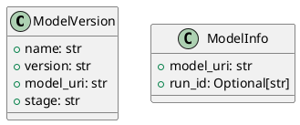

# Module Specification: entities

* **Source Reference:** `src/autogen_team/registry/entities.py`

## 1. Architectural Role & Responsibilities
**Purpose:**
Registry Domain Entities.

**Responsibilities:**
- [LLM Synthesis Required: Define responsibilities]

**Main Workflow:**
- [LLM Synthesis Required: Define main workflow]

## 2. Dependencies
**Imports:**
- `dataclasses.dataclass`
- `typing.Optional`

**Exported Classes:**
- `ModelVersion`
- `ModelInfo`

**Exported Functions:**

## 3. Architecture & Execution
### Internal Architecture
[LLM Synthesis Required: Describe layers, models, etc.]

### Execution Flow
[LLM Synthesis Required: Describe execution flow]

### Sequence Explanation
[LLM Synthesis Required: Describe sequence]

## 4. UML 2.0 Diagrams
### Class Diagram

## 5. Class & Method Specifications
### `ModelVersion` ([`src/autogen_team/registry/entities.py`](/src/autogen_team/registry/entities.py))
#### Overview
Represents a registered model version.

#### Constructor
**Initialization:** Default constructor. Initializes an empty instance.

#### Attributes
- `name` (`str`): Maintains the state for name.
- `version` (`str`): Maintains the state for version.
- `model_uri` (`str`): Maintains the state for model_uri.
- `stage` (`str`): Maintains the state for stage.

#### Methods
### `ModelInfo` ([`src/autogen_team/registry/entities.py`](/src/autogen_team/registry/entities.py))
#### Overview
Represents model metadata.

#### Constructor
**Initialization:** Default constructor. Initializes an empty instance.

#### Attributes
- `model_uri` (`str`): Maintains the state for model_uri.
- `run_id` (`Optional[str]`): Maintains the state for run_id.

#### Methods
## 6. Module Functions