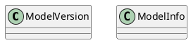

# Document: src/autogen_team/registry/entities.py

## Module Overview

Registry Domain Entities.

### Purpose
Provides functionality for `entities`.

### Responsibilities
Handles operations and definitions related to `entities`.

### Main Workflow
Execution flow defined by the functions and classes in the module.

### Dependencies
- `dataclasses.dataclass`
- `typing.Optional`

## Public API

### Exported Classes
- `ModelVersion`
- `ModelInfo`

### Exported Functions
None

## Class `ModelVersion`

### Overview

Represents a registered model version.

### Attributes

- `name` (str): Public property.
- `version` (str): Public property.
- `model_uri` (str): Public property.
- `stage` (str): Public property.

## Class `ModelInfo`

### Overview

Represents model metadata.

### Attributes

- `model_uri` (str): Public property.
- `run_id` (Optional[str]): Public property.

## UML Diagram

