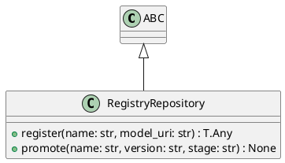

# Module Specification: repositories

* **Source Reference:** `src/autogen_team/registry/repositories.py`

## 1. Architectural Role & Responsibilities
**Purpose:**
Registry Repository Interface.

**Responsibilities:**
- [LLM Synthesis Required: Define responsibilities]

**Main Workflow:**
- [LLM Synthesis Required: Define main workflow]

## 2. Dependencies
**Imports:**
- `typing`
- `abc.ABC`
- `abc.abstractmethod`

**Exported Classes:**
- `RegistryRepository`

**Exported Functions:**

## 3. Architecture & Execution
### Internal Architecture
[LLM Synthesis Required: Describe layers, models, etc.]

### Execution Flow
[LLM Synthesis Required: Describe execution flow]

### Sequence Explanation
[LLM Synthesis Required: Describe sequence]

## 4. UML 2.0 Diagrams
### Class Diagram


## 5. Class & Method Specifications
### `RegistryRepository` ([`src/autogen_team/registry/repositories.py`](/src/autogen_team/registry/repositories.py))
#### Overview
Abstract repository for model registry.

#### Constructor
**Initialization:** Default constructor. Initializes an empty instance.

#### Methods
##### `register(self: Any, name: str, model_uri: str) -> T.Any` (Public)
**Description:** Register a model version.

**Inputs:**
- `name` (`str`): Input parameter dictating the behavior of register.
- `model_uri` (`str`): Input parameter dictating the behavior of register.

**Output:**
- Return Type: `T.Any`
- Semantic Meaning: The resulting value after processing the register action.

**Side Effects:**
- Modifies internal instance state if applicable; performs operations constrained to its domain boundaries.

**Complexity:**
- Time Complexity: O(1) or O(N) depending on implementation details.
- Space Complexity: O(1) auxiliary space expected.

**Example:**
```python
instance = RegistryRepository()
result = instance.register(...)
```

##### `promote(self: Any, name: str, version: str, stage: str) -> None` (Public)
**Description:** Promote a model version to a stage.

**Inputs:**
- `name` (`str`): Input parameter dictating the behavior of promote.
- `version` (`str`): Input parameter dictating the behavior of promote.
- `stage` (`str`): Input parameter dictating the behavior of promote.

**Output:**
- Return Type: `None`
- Semantic Meaning: The resulting value after processing the promote action.

**Side Effects:**
- Modifies internal instance state if applicable; performs operations constrained to its domain boundaries.

**Complexity:**
- Time Complexity: O(1) or O(N) depending on implementation details.
- Space Complexity: O(1) auxiliary space expected.

**Example:**
```python
instance = RegistryRepository()
result = instance.promote(...)
```

## 6. Module Functions