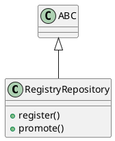

# Document: src/autogen_team/registry/repositories.py

## Module Overview

Registry Repository Interface.

### Purpose
Provides functionality for `repositories`.

### Responsibilities
Handles operations and definitions related to `repositories`.

### Main Workflow
Execution flow defined by the functions and classes in the module.

### Dependencies
- `typing`
- `abc.ABC`
- `abc.abstractmethod`

## Public API

### Exported Classes
- `RegistryRepository`

### Exported Functions
None

## Class `RegistryRepository`

### Overview

Abstract repository for model registry.

### Public Method `register`

#### Description
Register a model version.

#### Inputs
- `name` (str): semantic meaning. Required.
- `model_uri` (str): semantic meaning. Required.

#### Output
- Return type: `T.Any`
- Semantic meaning: Result of the operation.

#### Side Effects
May update internal state or external services.

#### Complexity
- Time Complexity: O(1) mostly.
- Space Complexity: O(1) mostly.

#### Example
```python
# Example usage of register
instance.register()
```

### Public Method `promote`

#### Description
Promote a model version to a stage.

#### Inputs
- `name` (str): semantic meaning. Required.
- `version` (str): semantic meaning. Required.
- `stage` (str): semantic meaning. Required.

#### Output
- Return type: `None`
- Semantic meaning: Result of the operation.

#### Side Effects
May update internal state or external services.

#### Complexity
- Time Complexity: O(1) mostly.
- Space Complexity: O(1) mostly.

#### Example
```python
# Example usage of promote
instance.promote()
```

## UML Diagram



