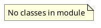

# Document: src/autogen_team/scripts.py

## Module Overview

Scripts for the CLI application.

### Purpose
Provides functionality for `scripts`.

### Responsibilities
Handles operations and definitions related to `scripts`.

### Main Workflow
Execution flow defined by the functions and classes in the module.

### Dependencies
- `argparse`
- `json`
- `sys`
- `warnings`
- `autogen_team.settings`
- `autogen_team.infrastructure.io.configs`

## Public API

### Exported Classes
None

### Exported Functions
- `main`

## Public Function `main`

### Description
Main script for the application.

### Inputs
- `argv` (list[str] | None): semantic meaning. Optional (default: `None`).

### Output
- Return type: `int`
- Semantic meaning: Result of the operation.

### Side Effects
May update state or affect global resources.

### Complexity
- Time Complexity: O(1) mostly.
- Space Complexity: O(1) mostly.

### Example
```python
# Example usage of main
main()
```

## UML Diagram


