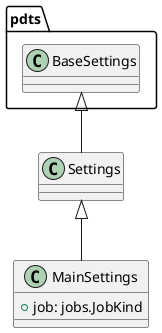

# Module Specification: settings

* **Source Reference:** `src/autogen_team/settings.py`

## 1. Architectural Role & Responsibilities
**Purpose:**
Define settings for the application.

**Responsibilities:**
- [LLM Synthesis Required: Define responsibilities]

**Main Workflow:**
- [LLM Synthesis Required: Define main workflow]

## 2. Dependencies
**Imports:**
- `pydantic`
- `pydantic_settings`
- `autogen_team.application.jobs`

**Exported Classes:**
- `Settings`
- `MainSettings`

**Exported Functions:**

## 3. Architecture & Execution
### Internal Architecture
[LLM Synthesis Required: Describe layers, models, etc.]

### Execution Flow
[LLM Synthesis Required: Describe execution flow]

### Sequence Explanation
[LLM Synthesis Required: Describe sequence]

## 4. UML 2.0 Diagrams
### Class Diagram

## 5. Class & Method Specifications
### `Settings` ([`src/autogen_team/settings.py`](/src/autogen_team/settings.py))
#### Overview
Base class for application settings.

Use settings to provide high-level preferences.
i.e., to separate settings from provider (e.g., CLI).

#### Constructor
**Initialization:** Default constructor. Initializes an empty instance.

#### Methods
### `MainSettings` ([`src/autogen_team/settings.py`](/src/autogen_team/settings.py))
#### Overview
Main settings of the application.

Parameters:
    job (jobs.JobKind): job to run.

#### Constructor
**Initialization:** Default constructor. Initializes an empty instance.

#### Attributes
- `job` (`jobs.JobKind`): Maintains the state for job.

#### Methods
## 6. Module Functions