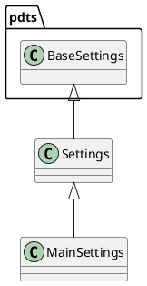

# Document: src/autogen_team/settings.py

## Module Overview

Define settings for the application.

### Purpose
Provides functionality for `settings`.

### Responsibilities
Handles operations and definitions related to `settings`.

### Main Workflow
Execution flow defined by the functions and classes in the module.

### Dependencies
- `pydantic`
- `pydantic_settings`
- `autogen_team.application.jobs`

## Public API

### Exported Classes
- `Settings`
- `MainSettings`

### Exported Functions
None

## Class `Settings`

### Overview

Base class for application settings.

Use settings to provide high-level preferences.
i.e., to separate settings from provider (e.g., CLI).

## Class `MainSettings`

### Overview

Main settings of the application.

Parameters:
    job (jobs.JobKind): job to run.

### Attributes

- `job` (jobs.JobKind): Public property.

## UML Diagram

