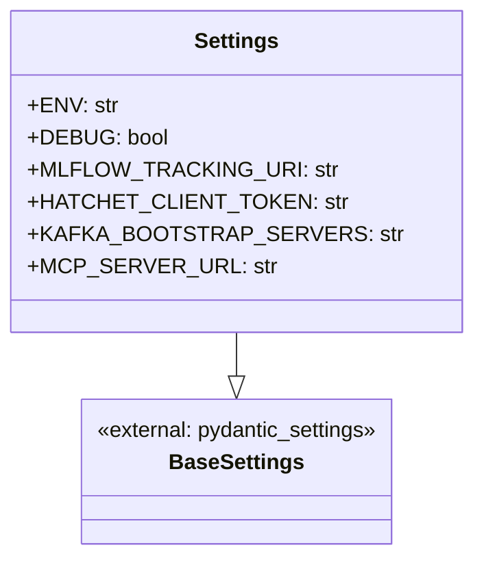
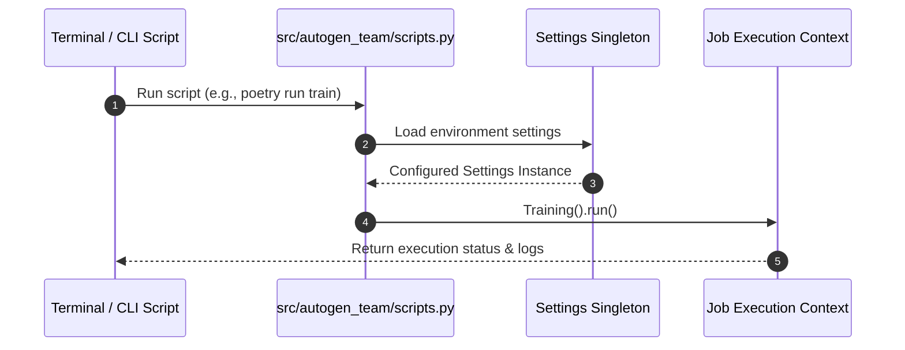

# Module Name: settings_and_scripts

* **Source Reference:** `src/autogen_team/settings.py` & `src/autogen_team/scripts.py`
* **Package Dependency:** Upstream: `pydantic-settings`, `os`. Downstream: CLI scripts, execution jobs, test runners.

## 1. Executive Summary & Purpose

The `settings` module provides central configuration management using `pydantic_settings.BaseSettings`, parsing environment variables (`.env`) for service endpoints, API keys, database connections, and execution modes. The `scripts` module provides CLI task entrypoints (e.g. `train`, `evaluate`, `tune`, `inference`) invoked via Poetry or shell execution.

## 2. UML 2.0 Class & Configuration Architecture

## 3. Package & Class Relations

* **Environment Integration:** `Settings` automatically parses `.env` files and environment variables, supplying configuration parameters to `MlflowService`, `HatchetService`, `KafkaApp`, and `MCPClient`.
* **CLI Commands (`scripts.py`):** Wraps high-level job instantiations (`Training`, `Tuning`, `Inference`, `Evaluations`) with CLI argument parsing and error logging.

## 4. Execution Flow & Runtime Behavior

---

* **Source Citations:**
  * Settings Specification: `src/autogen_team/settings.py:1-25`
  * CLI Script Entrypoints: `src/autogen_team/scripts.py:1-45`
