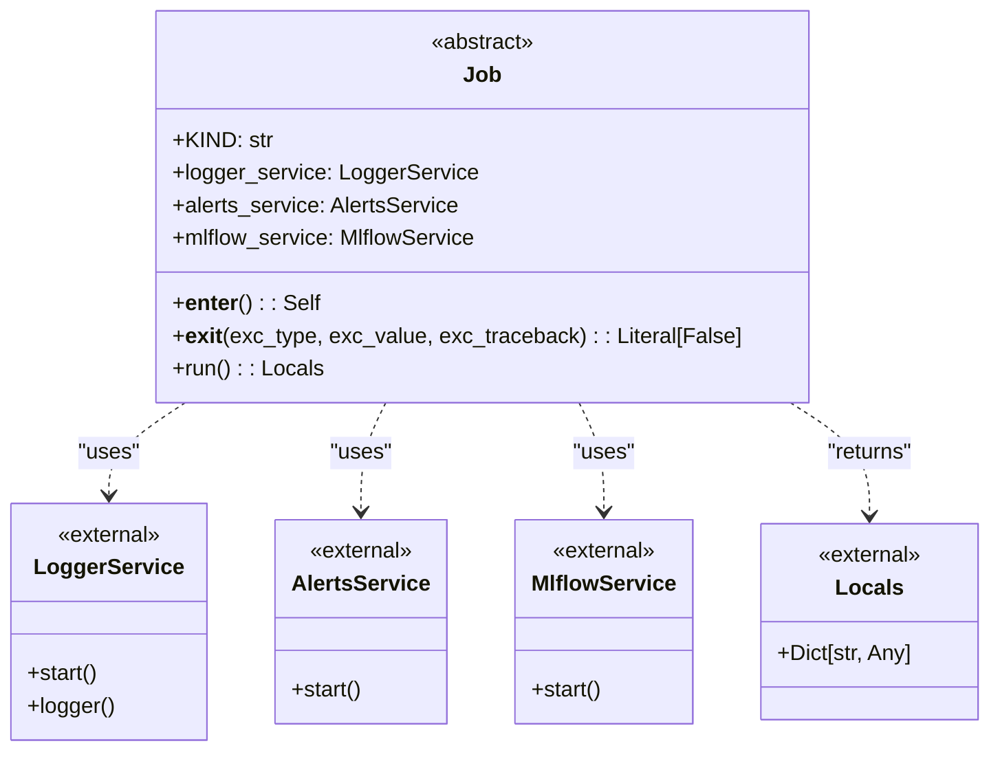

# US [High-Level Project Jobs](./backlog_llmlops_regresion.md) : Manage the execution context for high-level project jobs with integrated services.

- [US High-Level Project Jobs : Manage the execution context for high-level project jobs with integrated services.](#us-high-level-project-jobs--manage-the-execution-context-for-high-level-project-jobs-with-integrated-services)
  - [classes relations](#classes-relations)
  - [**User Stories: Base Job Class**](#user-stories-base-job-class)
    - [**1. User Story: Define Job Context**](#1-user-story-define-job-context)
    - [**2. User Story: Initialize and Start Services**](#2-user-story-initialize-and-start-services)
    - [**3. User Story: Stop and Cleanup Services**](#3-user-story-stop-and-cleanup-services)
    - [**4. User Story: Abstract Run Method Implementation**](#4-user-story-abstract-run-method-implementation)
    - [**Common Acceptance Criteria**](#common-acceptance-criteria)
    - [**Definition of Done (DoD):**](#definition-of-done-dod)
  - [Code location](#code-location)
  - [Test location](#test-location)

---

## classes relations

## **User Stories: Base Job Class**

---

### **1. User Story: Define Job Context**

**Title:**
As a **developer**, I want to define a context for executing high-level jobs so that setup and teardown procedures for integrated services are managed automatically.

**Description:**
The `Job` class provides a base implementation for managing the execution context of high-level project jobs. It handles the lifecycle of various services such as logging, alerts, and MLflow tracking.

**Acceptance Criteria:**

- The `Job` class provides a base implementation for all job types in the system.
- Attributes for `logger_service`, `alerts_service`, and `mlflow_service` are initialized with default service implementations.

---

### **2. User Story: Initialize and Start Services**

**Title:**
As a **developer**, I want the context to automatically initialize and start logging, alerting, and MLflow tracking services when a job begins, so that I can ensure that the services are available throughout the execution.

**Description:**
The `__enter__` method initializes and starts the configured services (logger, alerts, and MLflow) at the beginning of the job execution context.

**Acceptance Criteria:**

- The `__enter__` method is called when the job context is entered.
- The logging service is started and a debug message is logged.
- The alerts service is started.
- The MLflow service is started.
- The method returns the current Job instance.

---

### **3. User Story: Stop and Cleanup Services**

**Title:**
As a **developer**, I want the context to automatically stop and cleanup the configured services when the job completes, so that I can ensure resources are properly managed and avoid any lingering processes.

**Description:**
The `__exit__` method stops and cleans up the logging, alerting, and MLflow tracking services upon exiting the job execution context.

**Acceptance Criteria:**

- The `__exit__` method is called when the job context is exited.
- The MLflow service is stopped and a debug message is logged.
- The alerts service is stopped.
- The logging service is stopped.
- The method always returns `False` to propagate any exceptions that may have occurred.

---

### **4. User Story: Abstract Run Method Implementation**

**Title:**
As a **developer**, I want the `Job` class to define an abstract `run` method, so that all subclasses are required to implement their specific execution logic.

**Description:**
The abstract `run` method defines the interface for executing the job-specific logic within the managed context, allowing for a consistent execution pattern across different job types.

**Acceptance Criteria:**

- The `run` method is declared as abstract.
- Subclasses must implement the `run` method.
- The `run` method returns a dictionary of local job variables.

---

### **Common Acceptance Criteria**

1.  **Base Class Implementation**:

    - The `Job` class is abstract and cannot be instantiated directly.
    - All concrete job types must inherit from the `Job` class.

2.  **Service Management**:

    - The `__enter__` method starts all configured services.
    - The `__exit__` method stops all configured services.

3.  **Error Propagation**:

    - The `__exit__` method always returns `False`, ensuring that any exceptions raised during job execution are propagated.

4.  **Logging**:

    - The `LoggerService` is used to log lifecycle events (start and stop) for each service.

5.  **Flexibility**:

    - The structure is flexible, allowing different types of services to be added or removed easily.

6.  **Validation**:
    - Pydantic's `BaseModel` handles validation of parameters.
    - The `strict=True`, `frozen=True`, and `extra="forbid"` configuration options ensure that the class is immutable and that only defined fields are allowed.

---

### **Definition of Done (DoD):**

- The `Job` class is implemented with all specified methods and attributes.
- Abstract methods enforce implementation in derived classes.
- The class integrates seamlessly with `LoggerService`, `AlertsService`, and `MlflowService`.
- Unit tests validate the functionality and robustness of the class.
- Documentation is complete, with examples and clear explanations.

## Code location

- **Application Layer (Jobs Base)**: [src/autogen_team/application/jobs/base.py](../src/autogen_team/application/jobs/base.py)

## Test location

- [tests/application/jobs/test_base.py](../tests/application/jobs/test_base.py)
