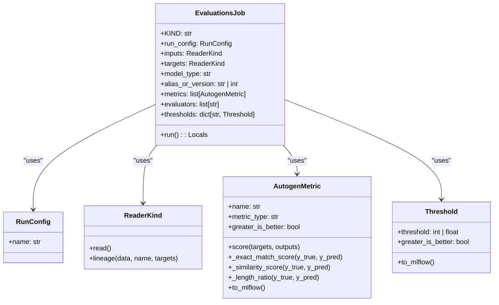

# US [Model Evaluation Job](./backlog_llmlops_regresion.md) : Define a job for evaluating registered models with given datasets.
I'll help create user stories for the provided code.

- [US Model Evaluation Job : Define a job for evaluating registered models with given datasets.](#us-model-evaluation-job--define-a-job-for-evaluating-registered-models-with-given-datasets)
  - [classes relations](#classes-relations)
  - [**User Stories: Autogen Evaluation Job Management**](#user-stories-autogen-evaluation-job-management)
    - [**1. User Story: Configure Evaluation Job**](#1-user-story-configure-evaluation-job)
    - [**2. User Story: Read Input and Target Data**](#2-user-story-read-input-and-target-data)
    - [**3. User Story: Log Data Lineage**](#3-user-story-log-data-lineage)
    - [**4. User Story: Evaluate Model Against Data**](#4-user-story-evaluate-model-against-data)
    - [**5. User Story: Notify Completion of Evaluations**](#5-user-story-notify-completion-of-evaluations)
    - [**Common Acceptance Criteria**](#common-acceptance-criteria)
    - [**Definition of Done (DoD):**](#definition-of-done-dod)
  - [Code location](#code-location)
  - [Test location](#test-location)

------------

## classes relations

## **User Stories: Autogen Evaluation Job Management**

---

### **1. User Story: Configure Evaluation Job**

**Title:**
As a **data scientist**, I want to configure an evaluation job for an Autogen model, so that I can set specific parameters for evaluating its performance on question-answering tasks.

**Description:**
The `EvaluationsJob` class allows users to configure an evaluation job, defining parameters such as the run configuration, data sources for inputs and targets, the model type, alias or version, metrics, evaluators, and performance thresholds. This class should support the specific needs of Autogen models, particularly for question-answering evaluations.

**Acceptance Criteria:**

- The job should be initializable, configurable via Python code, by setting input data, target data, and run configurations.
- Default values are properly set for the evaluation metrics.
- It should configure the `AutogenMetric` list using the proper  `metric_type`

---

### **2. User Story: Read Input and Target Data**

**Title:**
As a **data analyst**, I want to be able to read input data and expected target responses for my Autogen model from configured data sources, so I can feed it into the evaluation job and make sure it is working on real scenarios.

**Description:**
The  `EvaluationsJob` must be able to read the input and target data from their sources.

**Acceptance Criteria:**

- The inputs from specified ReaderKind are properly reading data.
- The targets for the model  to train or make searchs has to be properly configured.
---

### **3. User Story: Log Data Lineage**

**Title:**
As a **data engineer**, I want to log the lineage of input and target data used to evaluate Autogen models, so that there is traceability and auditing of the evaluation processes.

**Description:**
This story involves configuring the  `EvaluationsJob` to log the lineage of the used data.

**Acceptance Criteria:**

- The MLflow tracking has to track each input with lineage tracking.
- It should create lineage information in the right way, like the targets.

---

### **4. User Story: Evaluate Model Against Data**

**Title:**
As a **data scientist**, I want to evaluate Autogen responses to know the model performance for Q&A
**Description:**
The  `EvaluationsJob` has to evaluate and read if the model´s metrics reach the requierments for a Q&A.

**Acceptance Criteria:**

- Must has a default configuration for the metrics
- The results from metrics can be viewed.

---

### **5. User Story: Notify Completion of Evaluations**

**Title:**
As a **stakeholder**, I want to receive a notification to see if the performance evaluation finishes correctly.

**Description:**
The  `EvaluationsJob` is able to send a message saying that the execution has finished.

**Acceptance Criteria:**

- A messaje in the alerts system saying that the execution has finished is raised
---

### **Common Acceptance Criteria**

1. **Implementation Requirements:**
   - The `EvaluationsJob` class inherits from a base Job and defines a method to configure.
   - A Pydantic schema is available for configuration
   - All job properties can be customizable.

2. **Error Handling:**
   - The job has to have error handling for each process.

3. **Testing:**
   - Implement unit tests to validate correct data reading and configuration

4. **Documentation:**
   - Include comprehensive docstrings describing its purpose and usage.

---

### **Definition of Done (DoD):**

- All acceptance criterias are fulfilled and the pull request has been reviewed.

## Code location

[src/autogen_team/jobs/evaluations.py](../src/autogen_team/jobs/evaluations.py)

## Test location

[tests/jobs/test_evaluations.py](../tests/jobs/test_evaluations.py)