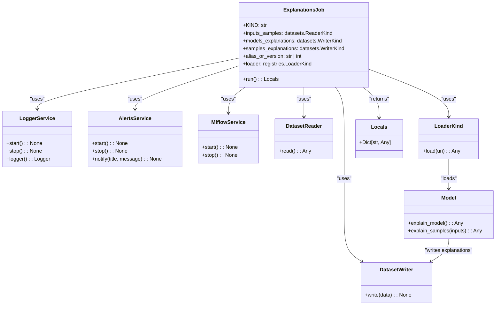

# US [Model Explanations Job](./backlog_llmlops_regresion.md) : Define a job for explaining the model structure and decisions.

- [US Model Explanations Job : Define a job for explaining the model structure and decisions.](#us-model-explanations-job--define-a-job-for-explaining-the-model-structure-and-decisions)
  - [classes relations](#classes-relations)
  - [**User Stories: Explanation Job Management**](#user-stories-explanation-job-management)
    - [**1. User Story: Configure Explanations Job**](#1-user-story-configure-explanations-job)
    - [**2. User Story: Read Input Samples**](#2-user-story-read-input-samples)
    - [**3. User Story: Load the Model**](#3-user-story-load-the-model)
    - [**4. User Story: Generate Model Explanations**](#4-user-story-generate-model-explanations)
    - [**5. User Story: Generate Sample Explanations**](#5-user-story-generate-sample-explanations)
    - [**6. User Story: Write Explanations to Data Sources**](#6-user-story-write-explanations-to-data-sources)
    - [**7. User Story: Notify Completion of Explanations**](#7-user-story-notify-completion-of-explanations)
    - [**Common Acceptance Criteria**](#common-acceptance-criteria)
    - [**Definition of Done (DoD):**](#definition-of-done-dod)
  - [Code location](#code-location)
  - [Test location](#test-location)

---

## classes relations

## **User Stories: Explanation Job Management**

---

### **1. User Story: Configure Explanations Job**

**Title:**
As a **data scientist**, I want to configure an explanations job that includes all the necessary parameters, so that I can generate insights into the model's decisions.

**Description:**
The `ExplanationsJob` class allows for setting up parameters such as input sample data readers, explanation writers, model references, and a loader for accessing the model from the registry.

**Acceptance Criteria:**

- The explanations job is initialized with required parameters.
- The parameters for readers and writers use the `KIND` discriminator.
- Default values are correctly handled for optional parameters.

---

### **2. User Story: Read Input Samples**

**Title:**
As a **data engineer**, I want to read input samples from specified sources, so that I can utilize them for generating explanations from the model.

**Description:**
In the `run` method, input samples are read using the configured data reader, ensuring that the data is prepared for explanation generation.

**Acceptance Criteria:**

- The job successfully reads input samples from the designated reader.
- Input data is validated using `schemas.InputsSchema.check`.

---

### **3. User Story: Load the Model**

**Title:**
As a **data scientist**, I want to load the registered model using a loader, so that I can generate explanations based on its structure and decisions.

**Description:**
The job utilizes the specified loader to access the designated version/alias from the model registry, so that it can create the explanations.

**Acceptance Criteria:**

- The model is correctly loaded from the registry using the configured loader.
- The model has to use an alias or version name.

---

### **4. User Story: Generate Model Explanations**

**Title:**
As a **data scientist**, I want to generate explanations for the model's structure and decisions, so that I can understand its functionament.

**Description:**
The `explain_model` method retrieves explanation from the model object.

**Acceptance Criteria:**

- The model can creates the explanations.

---

### **5. User Story: Generate Sample Explanations**

**Title:**
As a **data scientist**, I want to generate explanations for specific input samples, so that I can interpret individual predictions made by the model.

**Description:**
Sample explanations are generated based on the provided input samples, aiding in understanding how the model processes and predicts data.

**Acceptance Criteria:**

- The generated Explanations has the propper shape.

---

### **6. User Story: Write Explanations to Data Sources**

**Title:**
As a **data engineer**, I want to write the generated model and sample explanations to specified data outputs, so that I can store and retrieve them for later analysis.

**Description:**
The explanations generated for both the model and the input samples are saved to designated storage locations using the configured writers.

**Acceptance Criteria:**

- The generated models are saved.
- The generated samples are saved.

---

### **7. User Story: Notify Completion of Explanations**

**Title:**
As a **user**, I want to be notified once the explanation job is completed, so that I can review the outcome and any generated insights.

**Description:**
At the end of the job execution, notifications are sent to relevant stakeholders summarizing the particulars of the job completion.

**Acceptance Criteria:**

- The correct information has to be in the message.

---

### **Common Acceptance Criteria**

1. **Implementation Requirements:**

   - The `ExplanationsJob` class correctly implements the abstract `run` method from the base `Job` class.
   - All services (logging, model registry, alerts) are initialized at the start of the explanation job.

2. **Error Handling:**

   - Clear error messages are logged for any issues encountered during the reading, loading, or writing processes.

3. **Testing:**

   - The job has to pass all validation checks.

4. **Documentation:**
   - Each class and method has to have clear docstrings and be easy to understand.

---

### **Definition of Done (DoD):**

- The `ExplanationsJob` class is fully implemented.
- All functionalities have been tested and meets the acceptance criteria.
- All checks has to pass.
- The documentation has to be complete.

## Code location

- **Application Layer (Explanations Job)**: [src/autogen_team/application/jobs/explanations.py](../src/autogen_team/application/jobs/explanations.py)

## Test location

- [tests/application/jobs/test_explanations.py](../tests/application/jobs/test_explanations.py)
