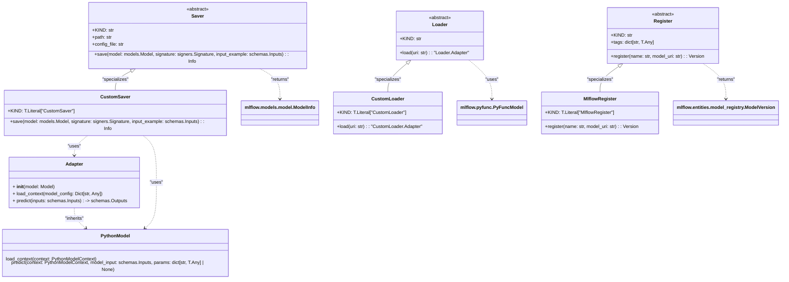

# US [Model Registry](./backlog_llmlops_regresion.md) : Manage saving, loading, and registering machine learning models using MLflow.

- [US Model Registry : Manage saving, loading, and registering machine learning models using MLflow.](#us-model-registry--manage-saving-loading-and-registering-machine-learning-models-using-mlflow)
  - [classes relations](#classes-relations)
  - [**User Stories: Model Saver and Loader**](#user-stories-model-saver-and-loader)
    - [**1. User Story: Save Models to Registry**](#1-user-story-save-models-to-registry)
    - [**2. User Story: Load Models from Registry**](#2-user-story-load-models-from-registry)
    - [**Common Acceptance Criteria**](#common-acceptance-criteria)
    - [**Definition of Done (DoD):**](#definition-of-done-dod)
  - [**User Stories: Custom and Built-in Savers**](#user-stories-custom-and-built-in-savers)
    - [**1. User Story: Saving Custom Models**](#1-user-story-saving-custom-models)
    - [**2. User Story: Using LiteLLM-compatible Client to Initialize CustomSaver Adapter**](#2-user-story-using-litellm-compatible-client-to-initialize-customsaver-adapter)
    - [**3. User Story: Load Configurations from JSON file**](#3-user-story-load-configurations-from-json-file)
    - [**4. User Story: Define prediction method**](#4-user-story-define-prediction--method)
    - [**Common Acceptance Criteria**](#common-acceptance-criteria-1)
    - [**Definition of Done (DoD):**](#definition-of-done-dod-1)
  - [**User Stories: Custom Loaders**](#user-stories-custom-loaders)
    - [**1. User Story: Loading Custom Models**](#1-user-story-loading-custom-models)
    - [**2. User Story: Adapt Custom Loaders**](#2-user-story-adapt-custom-loaders)
    - [**Common Acceptance Criteria**](#common-acceptance-criteria-2)
    - [**Definition of Done (DoD):**](#definition-of-done-dod-2)
  - [**User Stories: Model Registration**](#user-stories-model-registration)
    - [**1. User Story: Register Models in MLflow**](#1-user-story-register-models-in-mlflow)
    - [**Common Acceptance Criteria**](#common-acceptance-criteria-3)
    - [**Definition of Done (DoD):**](#definition-of-done-dod-3)
  - [Code location](#code-location)
  - [Test location](#test-location)

---

## classes relations

## **User Stories: Model Saver and Loader**

---

### **1. User Story: Save Models to Registry**

**Title:**
As a **data engineer**, I want to save machine learning models to an MLflow registry, so I can manage model versions and track their progression.

**Description:**
The `Saver` class serves as a base for saving models to the MLflow model registry. The `save` method allows for saving various types of models using either custom or built-in save methods.

**Acceptance Criteria:**

- The `save` method is implemented by subclasses of `Saver` (CustomSaver).
- Supports saving models with their signatures and input examples.
- Provides metadata regarding the saved model through `ModelInfo`.

---

### **2. User Story: Load Models from Registry**

**Title:**
As a **data scientist**, I want to load machine learning models from the MLflow registry, so I can easily make predictions with already registered models.

**Description:**
The `Loader` class serves as a base for loading models from the MLflow model registry. The `load` method allows for loading models which can then be used for inference.

**Acceptance Criteria:**

- The `load` method is implemented by subclasses of `Loader` (CustomLoader).
- Models can be loaded using a unique URI, providing flexibility in model retrieval.

---

### **Common Acceptance Criteria**

1. **Implementation Requirements:**

   - The `Saver` and `Loader` base classes cannot be instantiated directly.
   - Subclass implementations (CustomSaver, CustomLoader) must clearly define `save` and `load` methods, respectively.

2. **Error Handling:**

   - Appropriate errors are raised for failed save or load operations, including invalid model URIs and unsupported formats.

3. **Testing:**

   - Unit tests validate the correct implementation of save and load methods for all subclasses.
   - Tests cover both the handling of valid and invalid model URIs and serialization formats.

4. **Documentation:**
   - Each class and method has clear, instructive docstrings.
   - Examples illustrate common use cases for saving and loading models.

---

### **Definition of Done (DoD):**

- The `Saver` and `Loader` classes and all required methods are implemented with clear documentation.
- Subclasses (CustomSaver, CustomLoader) are tested for saving and loading various models.
- Code adheres to the project's coding standards and passes peer review.
- Unit tests have a wide coverage of scenarios and edge cases.

---

## **User Stories: Custom and Built-in Savers**

---

### **1. User Story: Saving Custom Models**

**Title:**
As a **machine learning engineer**, I want to save my custom models using the MLflow PyFunc module so that I can leverage MLflow's tracking and deployment features.

**Description:**
The `CustomSaver` class extends the `Saver` base class and implements the logic to save custom models that conform to the MLflow PyFunc flavor.

**Acceptance Criteria:**

- Custom models can be saved using the `save` method from the `CustomSaver` class.
- The saved model must retain its signature and input/output examples for later use.

---

### **2. User Story: Using LiteLLM-compatible Client to Initialize CustomSaver Adapter**

**Title:**
As a **machine learning engineer**, I want to use LiteLLM-compatible client for `CustomSaver` Adapter, so I can leverage the features provided and easy deployment via the client .

**Description:**
The `__init__` on `CustomSaver.Adapter` should have the functionality to setup a `LiteLLM`-compatible client ( `OpenAIChatCompletionClient` ) based on the provided configurations .

**Acceptance Criteria:**

- The `__init__` initializes a LiteLLM-compatible client in `CustomSaver.Adapter`.
- The config contains the fields model,api_key,base_url, temeperature and max_tokens.

---

### **3. User Story: Load Configurations from JSON file**

**Title:**
As a **machine learning engineer**, I want to load the model´s config from a specified path and use it later to load the model in the `CustomSaver.Adapter`class.

**Description:**
The `load_context` on `CustomSaver.Adapter` should load the context information from a json file and use it to initiate a new model

**Acceptance Criteria:**

- The load from the `config_file` property should be implemented correctly
- If a configuration is not provided should raise the exception Value Error
- If a file doesn´t exists should raise the exception FileNotFoundError

---

### **4. User Story: Define prediction method**

**Title:**
As a **machine learning engineer**, I want to define a method to predict and validate the `CustomeSaver` model for a `fastAPI` enpoint.

**Description:**
The `predict` method, should use the method already implemented and the response should follow the data Schema of the project.

**Acceptance Criteria:**

- The predict method should be implemented correctly
- The output should be a valid `schemas.Outputs` object, containing both the prediction and metadata.
- If something fails, the method should use the method of the model to try and infer otherwise the exception is handled

---

### **Common Acceptance Criteria**

1. **Implementation Requirements:**

   - The `CustomSaver` class extends the `Saver` base class and implements required methods.
   - All necessary parameters for saving models are correctly handled.

2. **Error Handling:**

   - The `save` method raises informative errors for issues such as unprocessable model types or incorrect input schemas.

3. **Testing:**

   - Unit tests verify successful model saving and correct handling of error scenarios.

4. **Documentation:**
   - Clear docstrings and usage examples for the `CustomSaver` class and associated `Adapter`.

---

### **Definition of Done (DoD):**

- The `CustomSaver` class is implemented and adheres to the design principles.
- The `save` method in `CustomSaver` successfully serializes and saves models.
- All functionality is tested with unit tests, including error scenarios.
- Documentation is complete, with clear instructions for usage and extensibility.

---

## **User Stories: Custom Loaders**

---

### **1. User Story: Loading Custom Models**

**Title:**
As a **data scientist**, I want to load custom models from the MLflow registry so that I can run inference on my custom ML models when needed.

**Description:**
The `CustomLoader` class is responsible for retrieving custom models stored in the MLflow registry and providing them for prediction purposes.

**Acceptance Criteria:**

- The `load` method retrieves the model and returns it wrapped in an adapter for inference.
- Supports flexible model input as per the defined schema.

---

### **2. User Story: Adapt Custom Loaders**

**Title:**
As a **Developer** ,I need to create a Custom adapter to load the context and predict the model, so the fastAPI can make request to the model.

**Description:**
The `Adapter` allows to adapt load the configurations and predict

**Acceptance Criteria:**

- The `load_context`method must be created.
- The `predict`method must return a `schemas.Outputs` objects.

---

### **Common Acceptance Criteria**

1. **Implementation Requirements:**

   - The `CustomLoader` class must implement the abstract methods from the Loader.

2. **Error Handling:**

   - Raised exceptions for issues encountered during model retrieval (e.g., non-existent models).

3. **Testing:**

   - Unit tests validate the loading of models and the appropriateness of the returned adapters.

4. **Documentation:**
   - Clear and comprehensive documentation for both loaders, including examples of usage.

---

### **Definition of Done (DoD):**

- The `CustomLoader` classes are implemented and adhere to the design principles.
- The loading process is verified in tests, including edge cases and error handling.
- Documentation is complete, with clear instructions for usage and extensibility.

## **User Stories: Model Registration**

---

### **1. User Story: Register Models in MLflow**

**Title:**
As a **data engineer**, I want to register models into the MLflow Model Registry, so I can keep track of different model versions over time.

**Description:**
The `MlflowRegister` class provides methods for registering models within the MLflow registry, allowing model management through versioning.

**Acceptance Criteria:**

- The `register` method can successfully save a model instance along with its URI.
- Proper versioning is maintained and retrievable through the registry interface.

---

### **Common Acceptance Criteria**

1. **Implementation Requirements:**

   - The `MlflowRegister` class extends the `Register` base class and implements the registration method.

2. **Error Handling:**

   - Informative errors are raised for registration issues, such as non-existent model URIs.

3. **Testing:**

   - Unit tests verify successful and error scenarios in model registration.

4. **Documentation:**
   - Documentation includes clear instructions on model registration processes.

---

### **Definition of Done (DoD):**

- The `MlflowRegister` class is fully implemented, passing all unit tests.
- Documentation is complete, with clear instructions for usage and extensibility.

## Code location

- **Data Access Layer (Registries Entities)**: [src/autogen_team/data_access/entities.py](../src/autogen_team/data_access/entities.py)
- **Data Access Layer (Registries Repositories)**: [src/autogen_team/data_access/repositories.py](../src/autogen_team/data_access/repositories.py)
- **Data Access Layer (Registries Adapters)**: [src/autogen_team/data_access/adapters/registries/](../src/autogen_team/data_access/adapters/registries/)

## Test location

- [tests/data_access/test_registries.py](../tests/data_access/test_registries.py)
