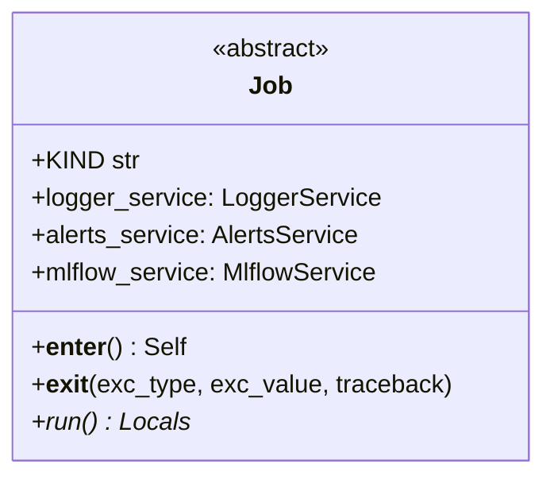
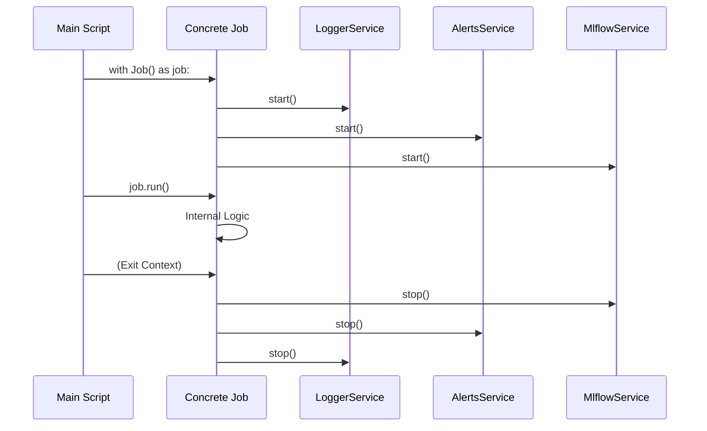

# Software Requirements Specification (SRS): Application Base Package

## 1. Introduction

### 1.1 Purpose

The `application` base package defines the high-level orchestration logic for jobs and pipelines within the project. It provides a consistent framework for executing tasks with integrated logging, alerting, and tracking.

### 1.2 Scope

This document covers the abstract `Job` class and its lifecycle management through context managers.

### 1.3 REPOSITORY CONTEXT

> [!IMPORTANT]
> Link to relevant directories in the repository for requirements context.

- **Source Code**: [jobs](file:///mnt/F024B17C24B145FE/Repos/llmops-python-package/src/autogen_team/application/jobs)
- **Base Job**: [base.py](file:///mnt/F024B17C24B145FE/Repos/llmops-python-package/src/autogen_team/application/jobs/base.py)

## 2. Overall Description

### 2.1 Product Perspective

The `application` layer sits at the top of the Onion Architecture, coordinate the interaction between the domain models and the infrastructure services to fulfill specific user stories or business processes.

## 3. Specific Requirements

### 3.1 Functional Requirements (Orchestration)

- **Job Lifecycle**: Must support a context-management pattern (`with` statement) to ensure all services (Logger, Alerts, MLflow) are started and stopped predictably.
- **Exception Handling**: Must propagate exceptions while ensuring services are gracefully shut down.
- **Service Integration**: Base jobs must come pre-integrated with default instances of `LoggerService`, `AlertsService`, and `MlflowService`.

### 3.2 Non-Functional Requirements

- **Consistency**: All high-level tasks (Training, Inference, Evaluation) must inherit from the base `Job` to maintain a uniform execution pattern.

## 4. Use Cases

### 4.1 Execute an Application Job

- **Actors**: Orchestrator / CI/CD
- **Description**: Run a concrete implementation of a job (e.g., InferenceJob).
- **Main Flow**:
  1. The orchestrator initializes the job.
  2. The `__enter__` method starts all dependencies.
  3. The `run()` method executes the specific business logic.
  4. Upon completion or error, `__exit__` cleans up service connections.

## 5. System Architecture Overview (High-level)

> [!TIP]
> This section links to the project-level SAR for deep architectural context.

- **Solution Architecture Report**: [Solution_Architecture_Report.md](Solution_Architecture_Report.md)

## 6. Visualizations (Mermaid)

### 6.1 UML Class Diagram (Application Base)

### 6.2 Execution Diagram (Job Lifecycle)

---

_Template generated for Agentic workflows._
