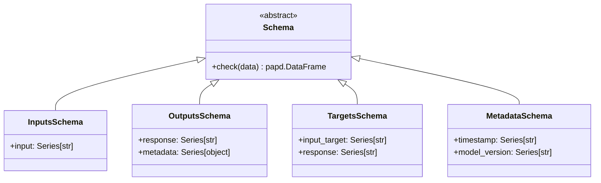

# Software Requirements Specification (SRS): Core Package

## 1. Introduction

### 1.1 Purpose

The `core` package defines the fundamental data schemas and validation logic shared across all layers of the `llmops-python-package`. It ensures data integrity and consistent communication between components.

### 1.2 Scope

This document covers the base `Schema` class and its specific implementations: `InputsSchema`, `OutputsSchema`, `TargetsSchema`, `MetadataSchema`, `SHAPValuesSchema`, and `FeatureImportancesSchema`.

### 1.3 REPOSITORY CONTEXT

> [!IMPORTANT]
> Link to relevant directories in the repository for requirements context.

- **Source Code**: [core](file:///mnt/F024B17C24B145FE/Repos/llmops-python-package/src/autogen_team/core)
- **Schemas**: [schemas.py](file:///mnt/F024B17C24B145FE/Repos/llmops-python-package/src/autogen_team/core/schemas.py)

## 2. Overall Description

### 2.1 Product Perspective

The `core` package provides the "Common Language" (in DDD terms) for the entire project. Every other package depends on `core` for its data definitions.

## 3. Specific Requirements

### 3.1 Functional Requirements (Data Validation)

- **Schema Validation**: All dataframes must be validated against their respective schemas using `pandera`.
- **Inputs Validation**: Must ensure input data contains a mandatory `input` column of type string.
- **Outputs Validation**: Must ensure output data contains a mandatory `response` column and a `metadata` column for traceability.
- **Targets Validation**: Must capture both the input prompt and the expected ground truth response.

### 3.2 Non-Functional Requirements

- **Strictness**: Schemas should enforce strict column checking and type coercion where appropriate to prevent runtime errors in LLM pipelines.

## 4. Use Cases

> [!NOTE]
> Define interactions between actors and the system for the core schemas.

### 4.1 Validate Model Inputs

- **Actors**: Data Access Layer / Application Layer
- **Description**: Ensure data loaded from external sources matches the expected structure.
- **Post-conditions**: A validated Pandera DataFrame is ready for processing.

## 5. System Architecture Overview (High-level)

> [!TIP]
> This section links to the project-level SAR for deep architectural context.

- **Solution Architecture Report**: [Solution_Architecture_Report.md](Solution_Architecture_Report.md)

## 6. Visualizations (Mermaid)

### 6.1 UML Class Diagram (Data Model)

---

_Template generated for Agentic workflows._
