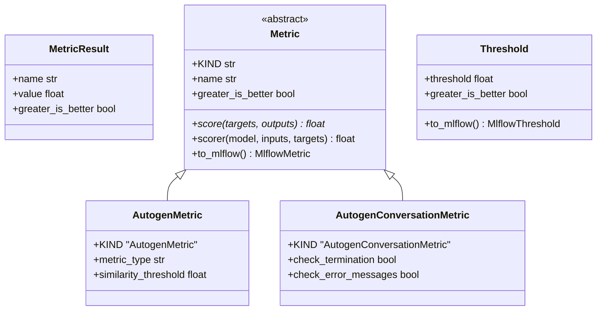
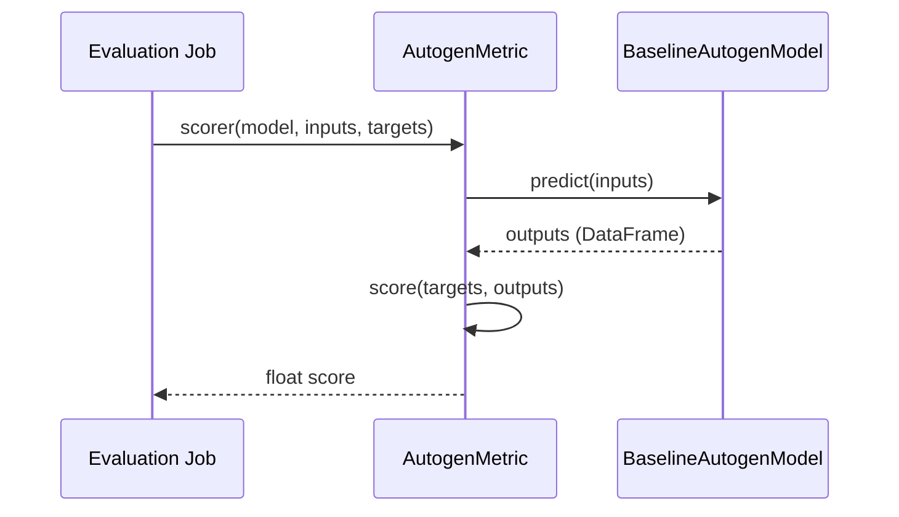

# Software Requirements Specification (SRS): Evaluation Package

## 1. Introduction

### 1.1 Purpose

The `evaluation` package provides the tools and metrics necessary to quantify the performance and quality of LLM-based agents and workflows.

### 1.2 Scope

This document covers the `MetricResult` entity, the abstract `Metric` base class, specific implementations for Autogen (similarity, exact match, conversation quality), and the `Threshold` monitoring logic.

### 1.3 REPOSITORY CONTEXT

> [!IMPORTANT]
> Link to relevant directories in the repository for requirements context.

- **Source Code**: [evaluation](file:///mnt/F024B17C24B145FE/Repos/llmops-python-package/src/autogen_team/evaluation)
- **Entities**: [entities.py](file:///mnt/F024B17C24B145FE/Repos/llmops-python-package/src/autogen_team/evaluation/entities.py)
- **Metrics**: [metrics.py](file:///mnt/F024B17C24B145FE/Repos/llmops-python-package/src/autogen_team/evaluation/metrics/metrics.py)

## 2. Overall Description

### 2.1 Product Perspective

The `evaluation` package is utilized by evaluation jobs to assess models before registration or deployment, ensuring they meet defined performance thresholds.

## 3. Specific Requirements

### 3.1 Functional Requirements (LLM Specific)

- **Text-Based Metrics**: Support for `exact_match`, `similarity` (using SequenceMatcher), and `length_ratio` between ground truth and LLM response.
- **Conversation Metrics**: Support for verifying agent termination and checking for error messages in the conversation metadata.
- **MLflow Integration**: Metrics must be convertible to `mlflow.metrics` for use with `mlflow.evaluate`.

### 3.2 Non-Functional Requirements

- **Consistency**: High-level evaluation results should be stored in a consistent `MetricResult` format.
- **Traceability**: Evaluation must be linked to specific model runs via the `Metric.scorer` interface.

## 4. Use Cases

### 4.1 Evaluate Model Performance

- **Actors**: Data Scientists / Automated CI/CD
- **Description**: Run a suite of metrics against a model and a test dataset.
- **Main Flow**:
  1. The evaluation service initializes a list of `Metric` objects.
  2. Each metric calls `scorer(model, inputs, targets)`.
  3. The `scorer` orchestrates model prediction and result computation.
- **Post-conditions**: A set of scores and metric results are generated and logged.

## 5. System Architecture Overview (High-level)

> [!TIP]
> This section links to the project-level SAR for deep architectural context.

- **Solution Architecture Report**: [Solution_Architecture_Report.md](Solution_Architecture_Report.md)

## 6. Visualizations (Mermaid)

### 6.1 UML Class Diagram

### 6.2 Execution Diagram (Evaluation Flow)

---

_Template generated for Agentic workflows._
