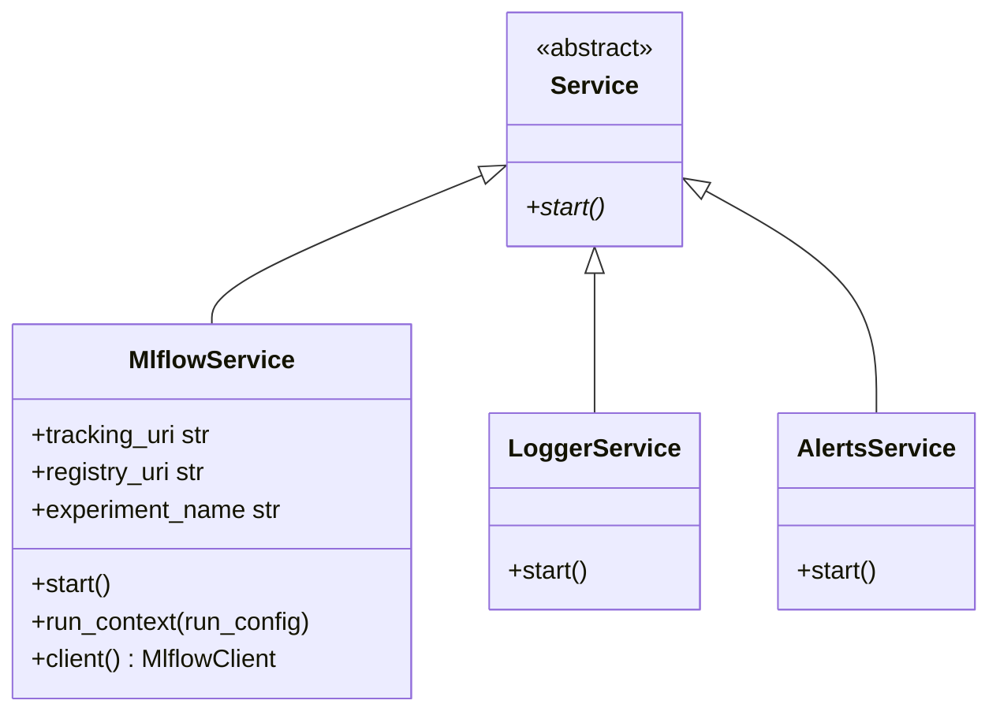
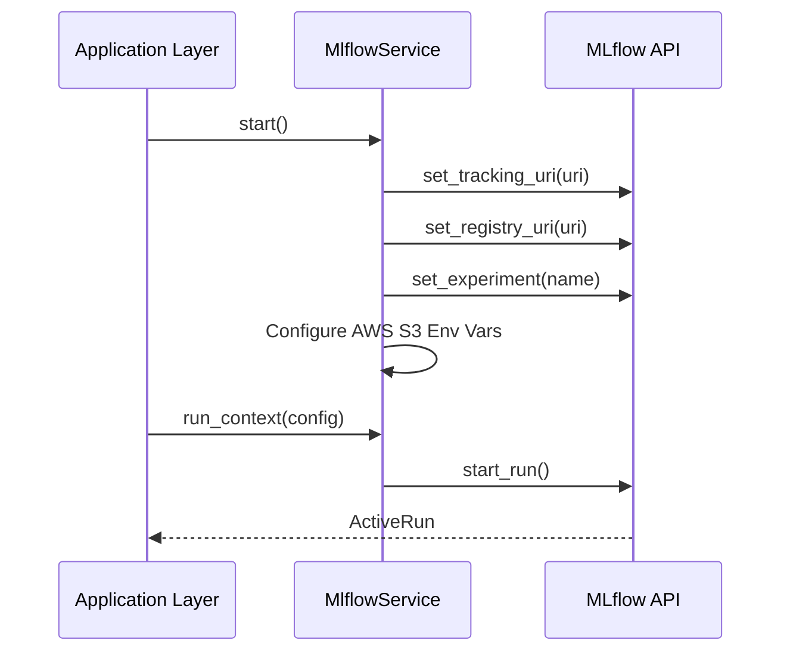

# Software Requirements Specification (SRS): Infrastructure Package

## 1. Introduction

### 1.1 Purpose

The `infrastructure` package provides technical capabilities and cross-cutting concerns that support the domain and application layers. It handles interactions with external services, logging, and environment management.

### 1.2 Scope

This document covers the shared `Service` architecture and specific implementations: `MlflowService` (tracking and registry), `LoggerService`, `AlertsService`, and various IO/Utils.

### 1.3 REPOSITORY CONTEXT

> [!IMPORTANT]
> Link to relevant directories in the repository for requirements context.

- **Source Code**: [infrastructure](file:///mnt/F024B17C24B145FE/Repos/llmops-python-package/src/autogen_team/infrastructure)
- **Services**: [services](file:///mnt/F024B17C24B145FE/Repos/llmops-python-package/src/autogen_team/infrastructure/services)
- **MLflow Service**: [mlflow_service.py](file:///mnt/F024B17C24B145FE/Repos/llmops-python-package/src/autogen_team/infrastructure/services/mlflow_service.py)

## 2. Overall Description

### 2.1 Product Perspective

As part of the Onion Architecture, the `infrastructure` layer is on the outermost circle. It implements the interfaces defined in the domain layer and provides supporting services used by the application layer.

## 3. Specific Requirements

### 3.1 Functional Requirements (Services)

- **MLflow Integration**: Must initialize tracking and registry URIs from environment variables and support S3 as an artifact store.
- **Logging**: Must provide a configurable `LoggerService` for capturing application traces.
- **Environment Management**: Must support parsing and merging project configurations via the `io` module.

### 3.2 Non-Functional Requirements

- **Decoupling**: Services should be accessible via a standard `start()` interface, ensuring they can be initialized consistently.
- **Resilience**: The `MlflowService` must handle environment variable substitution for security sensitive keys (AWS Access Keys).

## 4. Use Cases

### 4.1 Orchestrate an Experiment Run

- **Actors**: Application Layer Jobs
- **Description**: Setup the tracking environment for a new experiment.
- **Main Flow**:
  1. Call `MlflowService.start()`.
  2. Use `run_context(config)` to wrap the execution logic.
  3. Metrics and parameters are automatically logged to the tracking server.

## 5. System Architecture Overview (High-level)

> [!TIP]
> This section links to the project-level SAR for deep architectural context.

- **Solution Architecture Report**: [Solution_Architecture_Report.md](Solution_Architecture_Report.md)

## 6. Visualizations (Mermaid)

### 6.1 UML Class Diagram (Services)

### 6.2 Execution Diagram (MLflow Setup)

---

_Template generated for Agentic workflows._
