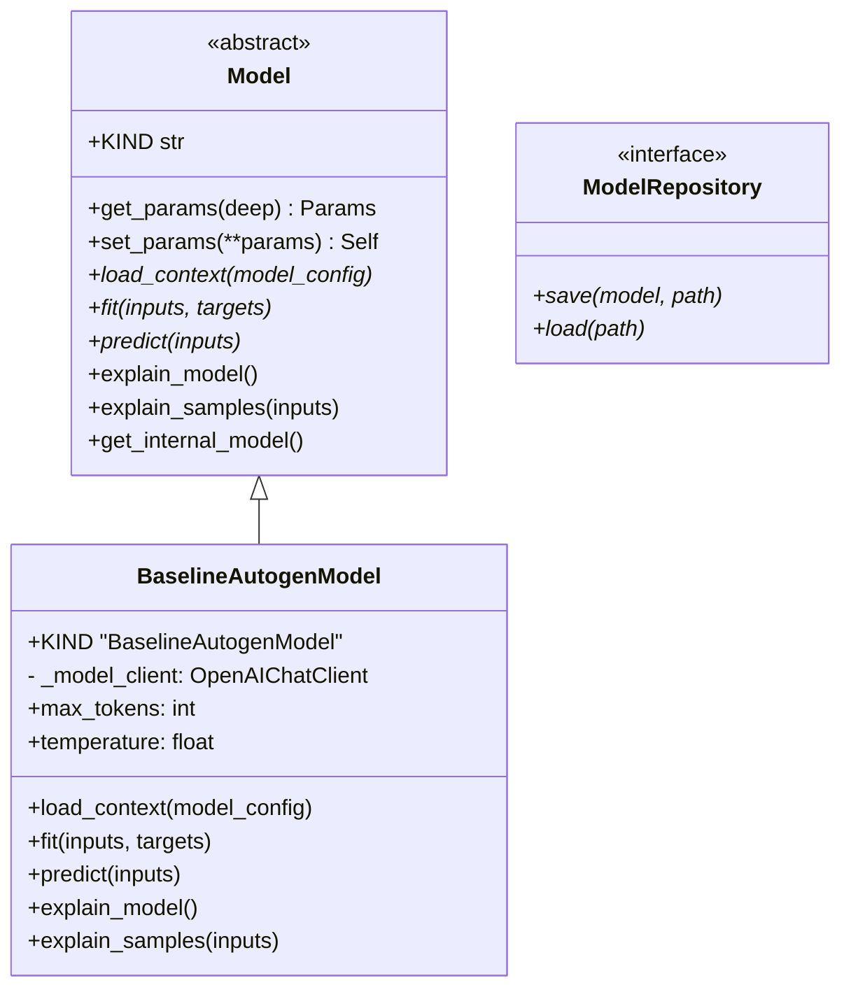
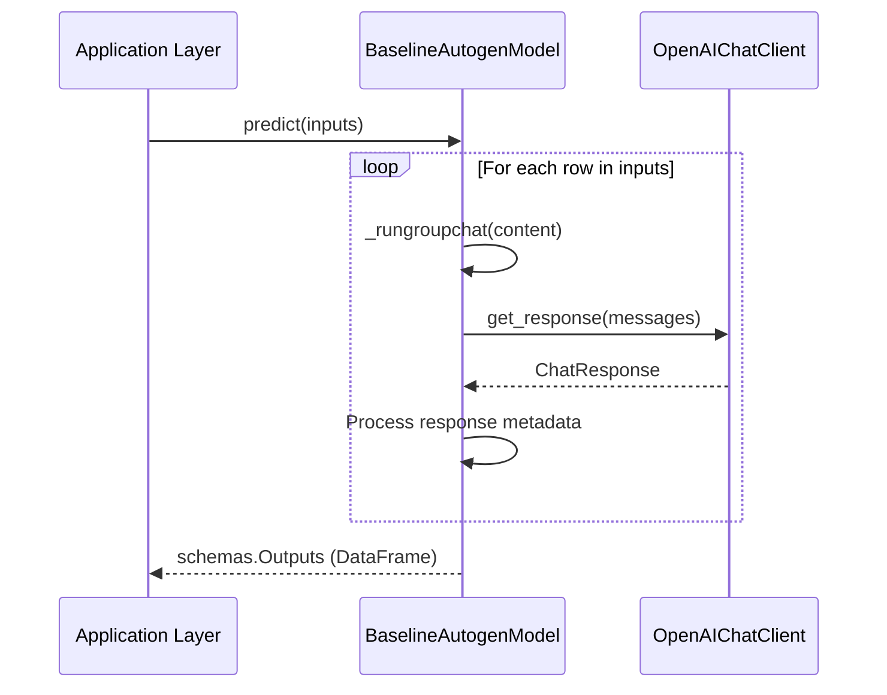

# Software Requirements Specification (SRS): Models Package

## 1. Introduction

### 1.1 Purpose

This document specifies the requirements for the `models` package within the LLMOps team project. This package defines the core model entities and repository interfaces.

### 1.2 Scope

This SRS covers the base `Model` abstraction and the `BaselineAutogenModel` implementation, including their persistence interfaces.

### 1.3 REPOSITORY CONTEXT

> [!IMPORTANT]
> Link to relevant directories in the repository for requirements context.

- **Source Code**: [models](file:///mnt/F024B17C24B145FE/Repos/llmops-python-package/src/autogen_team/models)
- **Entities**: [entities.py](file:///mnt/F024B17C24B145FE/Repos/llmops-python-package/src/autogen_team/models/entities.py)
- **Repositories**: [repositories.py](file:///mnt/F024B17C24B145FE/Repos/llmops-python-package/src/autogen_team/models/repositories.py)

## 2. Overall Description

### 2.1 Product Perspective

The `models` package is a core domain layer component that abstracts the underlying AI/ML frameworks (like Autogen/OpenAI) into a consistent interface for the application layer.

## 3. Specific Requirements

### 3.1 Functional Requirements (LLM Specific)

- **Baseline Autogen Model**: Must support group chat patterns via Autogen.
- **Client Initialization**: Must lazy-load the `OpenAIChatClient` using a provided configuration.
- **Prediction Mapping**: Must process tabular inputs and map LLM responses into a structured `schemas.Outputs` format.

### 3.2 Non-Functional Requirements

- **Maintainability**: Follows the Onion Architecture by defining abstract base classes for models and repositories.
- **Extensibility**: New model types (e.g., Llama, Anthropic) should be implementable by subclassing `Model`.

## 4. Use Cases

### 4.1 Generate Model Predictions

- **Actors**: Application Layer (Jobs)
- **Description**: Generate responses from an LLM for a batch of provided inputs.
- **Main Flow**:
  1. The Application layer calls `predict(inputs)`.
  2. The model iterates through inputs and calls `_rungroupchat`.
  3. The model client fetches responses from the external API.
- **Post-conditions**: A DataFrame of results with metadata (timestamp, model_version) is returned.

## 5. System Architecture Overview (High-level)

> [!TIP]
> This section links to the project-level SAR for deep architectural context.

- **Solution Architecture Report**: [Solution_Architecture_Report.md](Solution_Architecture_Report.md)

## 6. Visualizations (Mermaid)

### 6.1 UML Class Diagram

### 6.2 Execution Diagram (Flow)

---

_Template generated for Agentic workflows._
