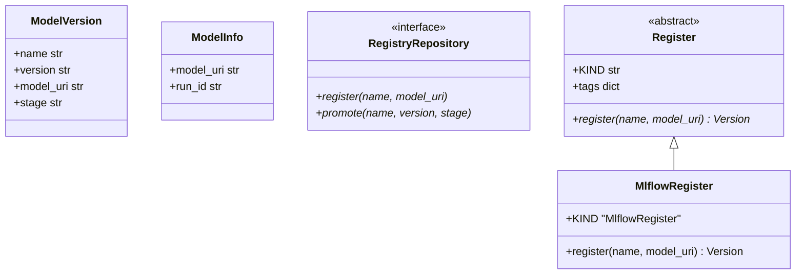
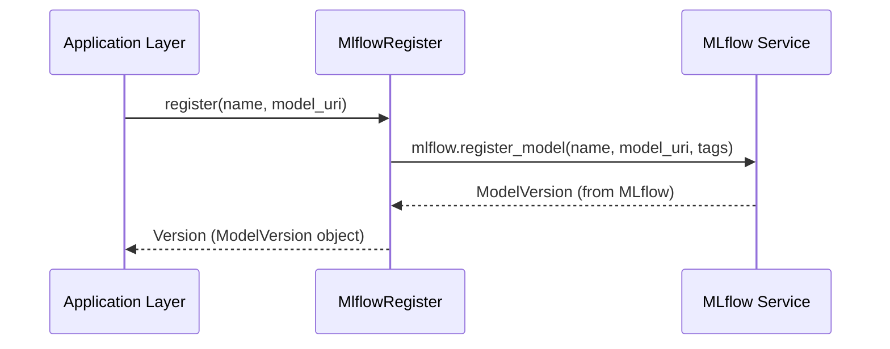

# Software Requirements Specification (SRS): Registry Package

## 1. Introduction

### 1.1 Purpose

The `registry` package manages the lifecycle of registered models, providing a unified interface for model registration and promotion between stages (e.g., Staging to Production).

### 1.2 Scope

This SRS covers the `ModelVersion` and `ModelInfo` entities, the `RegistryRepository` interface, and the MLflow-based adapters for model registration.

### 1.3 REPOSITORY CONTEXT

> [!IMPORTANT]
> Link to relevant directories in the repository for requirements context.

- **Source Code**: [registry](file:///mnt/F024B17C24B145FE/Repos/llmops-python-package/src/autogen_team/registry)
- **Entities**: [entities.py](file:///mnt/F024B17C24B145FE/Repos/llmops-python-package/src/autogen_team/registry/entities.py)
- **MLflow Adapter**: [mlflow_adapter.py](file:///mnt/F024B17C24B145FE/Repos/llmops-python-package/src/autogen_team/registry/adapters/mlflow_adapter.py)

## 2. Overall Description

### 2.1 Product Perspective

The `registry` package acts as a bridge between the core domain and external model management services like MLflow.

## 3. Specific Requirements

### 3.1 Functional Requirements (LLM Specific)

- **Model Registration**: Must register model artifacts into a versioned model registry.
- **Stage Promotion**: Must support promoting model versions between lifecycle stages (None, Staging, Production, Archived).
- **Metadata Management**: Must capture and store model URIs and run IDs for traceability.

### 3.2 Non-Functional Requirements

- **Interchangeability**: The use of abstract `Register` and `Saver/Loader` classes allows swapping MLflow for other registries (e.g., HuggingFace Hub) with minimal impact on core logic.

## 4. Use Cases

### 4.1 Register Model Version

- **Actors**: MLOps Pipelines
- **Description**: After a successful training or evaluation run, register the model as a new version.
- **Post-conditions**: A `ModelVersion` object is created and stored in the registry.

## 5. System Architecture Overview (High-level)

> [!TIP]
> This section links to the project-level SAR for deep architectural context.

- **Solution Architecture Report**: [Solution_Architecture_Report.md](Solution_Architecture_Report.md)

## 6. Visualizations (Mermaid)

### 6.1 UML Class Diagram

### 6.2 Execution Diagram (Registration Flow)

---

_Template generated for Agentic workflows._
