# US [Scchemas](./backlog_llmops_autogen.md) : Define structured data formats for input, output, and intermediate processes, ensuring consistency and validation throughout the pipeline

- [US Scchemas : Define structured data formats for input, output, and intermediate processes, ensuring consistency and validation throughout the pipeline](#us-scchemas--define-structured-data-formats-for-input-output-and-intermediate-processes-ensuring-consistency-and-validation-throughout-the-pipeline)
  - [classes relations](#classes-relations)
  - [**User Stories: Schema Definitions and Validation**](#user-stories-schema-definitions-and-validation)
    - [**1. User Story: Define a Base Schema Class**](#1-user-story-define-a-base-schema-class)
    - [**2. User Story: Check DataFrame Against Schema**](#2-user-story-check-dataframe-against-schema)
    - [**3. User Story: Implement Metadata Schema**](#3-user-story-implement-metadata-schema)
    - [**4. User Story: Implement Input Schema**](#4-user-story-implement-input-schema)
    - [**5. User Story: Implement Output Schema**](#5-user-story-implement-output-schema)
    - [**6. User Story: Implement Targets Schema**](#6-user-story-implement-targets-schema)
    - [**7. User Story: Implement SHAP Values Schema**](#7-user-story-implement-shap-values-schema)
    - [**8. User Story: Implement Feature Importances Schema**](#8-user-story-implement-feature-importances-schema)
    - [**Common Acceptance Criteria**](#common-acceptance-criteria)
    - [**Definition of Done (DoD):**](#definition-of-done-dod)
  - [Code location](#code-location)
  - [Test location](#test-location)

------------

## classes relations

```mermaid
classDiagram
    %% Base Class: Schema
    class Schema {
        <<abstract>>
        +Config
        +check( pd.DataFrame): papd.DataFrame[TSchema]
    }
    Schema ..> pa.DataFrameModel : "extends"

    %% Schema Config
    class SchemaConfig {
        +coerce: bool = True
        +strict: bool = True
    }
    Schema ..> SchemaConfig : "inner class"

    %% InputsSchema
    class InputsSchema {
        +input: papd.Series[padt.String]
    }
    Schema <|-- InputsSchema

    %% OutputsSchema
    class OutputsSchema {
        +response: papd.Series[padt.String]
        +meta papd.Series[padt.Object]
    }
    Schema <|-- OutputsSchema

    %% TargetsSchema
    class TargetsSchema {
        +input_target: papd.Series[padt.String]
        +response: papd.Series[padt.String]
    }
    Schema <|-- TargetsSchema

    %% SHAPValuesSchema
    class SHAPValuesSchema {
        +sample: papd.Series[padt.String]
        +explanation: papd.Series[padt.String]
        +shap_value: papd.Series[padt.Float32]
    }
    Schema <|-- SHAPValuesSchema

    %% FeatureImportancesSchema
    class FeatureImportancesSchema {
        +feature: papd.Series[padt.String]
        +importance: papd.Series[padt.Float32]
    }
    Schema <|-- FeatureImportancesSchema
    
    %% MetadataSchema
    class MetadataSchema {
      +timestamp: papd.Series[padt.String]
      +model_version: papd.Series[padt.String]
    }
    Schema <|-- MetadataSchema
```

## **User Stories: Schema Definitions and Validation**

---

### **1. User Story: Define a Base Schema Class**

**Title:**
As a **data engineer**, I want a **base `Schema` class** that leverages Pandera to ensure data quality and consistency across the project.

**Description:**
The `Schema` class will act as an abstract foundation for all data schemas within the project, utilizing `pandera.DataFrameModel` to provide powerful validation capabilities for Pandas DataFrames.

**Acceptance Criteria:**
- The `Schema` class inherits from `pandera.DataFrameModel`.
- A `Config` inner class is defined, setting `coerce` to `True` and `strict` to `True` for default behavior.
- A `check` method is implemented to validate a Pandas DataFrame against the schema.

---

### **2. User Story: Check DataFrame Against Schema**

**Title:**
As a **developer**, I want to use the `check` method on a given `Schema` to check whether a Pandas DataFrame conforms to that `Schema`.

**Description:**
The `check` method validates the structure and data types of a Pandas DataFrame against a defined Pandera schema, ensuring adherence to the expected data format.

**Acceptance Criteria:**
- The `check` method accepts a Pandas DataFrame as input.
- It returns a validated DataFrame that conforms to the schema.
- It uses `pandera.validate` to perform the validation.
- Type hinting is used to specify the return type as a validated Pandas DataFrame.

---

### **3. User Story: Implement Metadata Schema**

**Title:**
As a **data engineer**, I want to implement a schema for metadata outputs, so that I can enforce a consistent format for the logged metadata.

**Description:**
The `MetadataSchema` class enforces a specific format for metadata, ensuring that metadata entries include `timestamp` and `model_version`.

**Acceptance Criteria:**
- The schema includes the `timestamp` and `model_version` fields as strings.
- Metadata conforms to this schema is validated using `Schema.check`.

---

### **4. User Story: Implement Input Schema**

**Title:**
As a **data scientist**, I want to implement a schema for validating input data, so that I can ensure that all model inputs are properly formatted.

**Description:**
The `InputsSchema` class is designed to validate the structure of input data.

**Acceptance Criteria:**
- The schema includes a field for `input` as a series of strings.
- Dataframes that have been validated with this class pass the `check` method

---

### **5. User Story: Implement Output Schema**

**Title:**
As a **data scientist**, I want to implement a schema for validating output data, so that I can ensure that all model outputs are properly formatted.

**Description:**
The `OutputsSchema` class is designed to validate the structure of model output data that contains responses and associated metadata.

**Acceptance Criteria:**
- The schema includes fields for `response` (string) and `metadata` (object).
- Dataframes that have been validated with this class pass the `check` method

---

### **6. User Story: Implement Targets Schema**

**Title:**
As a **data scientist**, I want to implement a schema for validating the target dataset, so that I can ensure that ground truth data is properly formatted.

**Description:**
The `TargetsSchema` class is designed to validate target (ground truth) data.

**Acceptance Criteria:**
- The schema includes `input_target` and `response` fields as strings.
- Dataframes that have been validated with this class pass the `check` method

---

### **7. User Story: Implement SHAP Values Schema**

**Title:**
As a **machine learning researcher**, I want a schema for SHAP values, so that I can validate the structure and type of SHAP explanation outputs.

**Description:**
The `SHAPValuesSchema` class defines the schema for SHAP values.

**Acceptance Criteria:**
- The schema includes `sample` and `explanation` as string series, and `shap_value` as a float series.
- Strict data type enforcement is disabled (strict=False).

---

### **8. User Story: Implement Feature Importances Schema**

**Title:**
As a **machine learning engineer**, I want a schema for feature importances, so that I can validate the structure and types of feature importance data.

**Description:**
The `FeatureImportancesSchema` class is responsible for validating feature importance data.

**Acceptance Criteria:**
- The schema includes `feature` as a string series and `importance` as a float series.
- Dataframes that have been validated with this class pass the `check` method

---

### **Common Acceptance Criteria**

1. **Schemas are defined using pandera.DataFrameModel:** All schema classes should inherit from `pandera.DataFrameModel`.

2.  **Each schema should define the data types and constraints for each column:** Each column should have a specific datatype.

3.  **Each schema must have a check() method:** The `check()` method must validate incoming Pandas DataFrames and raise an informative error message if something is wrong.

### **Definition of Done (DoD):**

- The `Schema` class and all derived schema classes (`InputsSchema`, `OutputsSchema`, `TargetsSchema`, `SHAPValuesSchema`, `FeatureImportancesSchema`) are implemented and tested.
- All schema validation passes for valid data and fails appropriately for invalid data.
- The code is well-documented, and usage examples are provided.

## Code location

[src/autogen_team/core/schemas.py](../src/autogen_team/core/schemas.py)

## Test location

[tests/core/test_schemas.py](../tests/core/test_schemas.py)