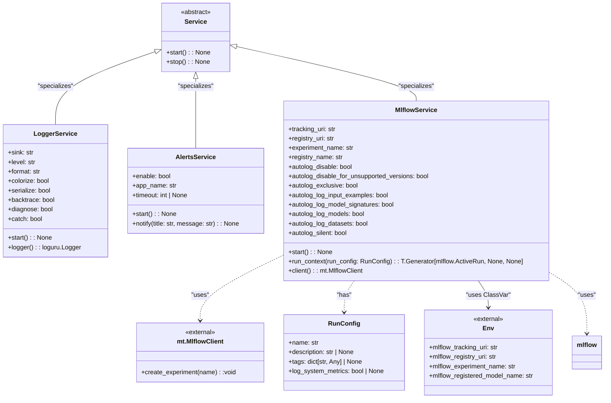

# US [Global Context Management](./backlog_llmlops_regresion.md) : Manage global contexts during execution for logging, notifications, and MLflow tracking.

- [US Global Context Management : Manage global contexts during execution for logging, notifications, and MLflow tracking.](#us-global-context-management--manage-global-contexts-during-execution-for-logging-notifications-and-mlflow-tracking)
  - [classes relations](#classes-relations)
  - [**User Stories: Global Services**](#user-stories-global-services)
    - [**1. User Story: Manage Logging Service**](#1-user-story-manage-logging-service)
    - [**2. User Story: Manage Notification Service**](#2-user-story-manage-notification-service)
    - [**3. User Story: Manage MLflow Tracking Service**](#3-user-story-manage-mlflow-tracking-service)
    - [**Common Acceptance Criteria**](#common-acceptance-criteria)
    - [**Definition of Done (DoD):**](#definition-of-done-dod)
  - [Code location](#code-location)
  - [Test location](#test-location)

------------

## classes relations

## **User Stories: Global Services**

---

### **1. User Story: Manage Logging Service**

**Title:**
As a **developer**, I want a centralized logging service that captures and formats log entries, so I can keep track of system activities and alerts.

**Description:**
The `LoggerService` class provides functionality to manage logging in the application using the Loguru library. It allows configuration of log outputs, levels, and formats.

**Acceptance Criteria:**
- The `start` method initializes the logger with the desired configuration.
- Log entries should show timestamps, log levels, and the source of the log message.
- The logger can be retrieved through the `logger` method.
- Support different `sink` destinations (stderr, stdout, and filepaths).

---

### **2. User Story: Manage Notification Service**

**Title:**
As a **user**, I want to be able to receive notifications from the application, so I can be alerted about important events or errors.

**Description:**
The `AlertsService` class provides capabilities to send notifications through the system or display them on the console if notifications are disabled.

**Acceptance Criteria:**
- The `start` method initializes the notification service (though it does nothing).
- The `notify` method allows sending notifications with a title and message.
- When notifications are disabled, messages should be printed to the console instead.
- Support configuration of `app_name` and `timeout`.

---

### **3. User Story: Manage MLflow Tracking Service**

**Title:**
As a **data scientist**, I want to manage MLflow tracking and model registry through a unified service, so I can easily log experiments and access models.

**Description:**
The `MlflowService` class integrates MLflow tracking features, enabling experiment management, automatic logging, and model registrations.

**Acceptance Criteria:**
- The `start` method sets the tracking and registry URIs and initializes the experiment for logging.
- Automatic logging of parameters and metrics is enabled based on the class configuration.
- Users can retrieve the MLflow client through the `client` method to perform direct MLflow API operations.
- The `run_context` method provides a context manager for tracking runs, allowing easy management of logging during model training.

---

### **Common Acceptance Criteria**

1. **Implementation Requirements:**
   - Each service class must extend the `Service` base class and implement the `start` method.
   - Clear separation of responsibilities among services (logging, notifications, MLflow tracking).

2. **Configuration:**
   - Each service should have configurable attributes that can be set via environment variables or default values.

3. **Testing:**
   - Unit tests validate the functionality of each service, ensuring they operate as intended when invoked.
   - Tests ensure that the logging outputs are correct, notifications are sent or printed based on settings, and MLflow is correctly configured.

4. **Documentation:**
   - Each class and method contains detailed docstrings and usage examples to guide users.

---

### **Definition of Done (DoD):**

- All required methods in `Service`, `LoggerService`, `AlertsService`, and `MlflowService` are implemented.
- Each service class passes all relevant tests.
- Documentation is clear, and examples are provided for usage.

## Code location

[src/autogen_team/io/services.py](../src/autogen_team/io/services.py)

## Test location

[tests/io/test_services.py](../tests/io/test_services.py)