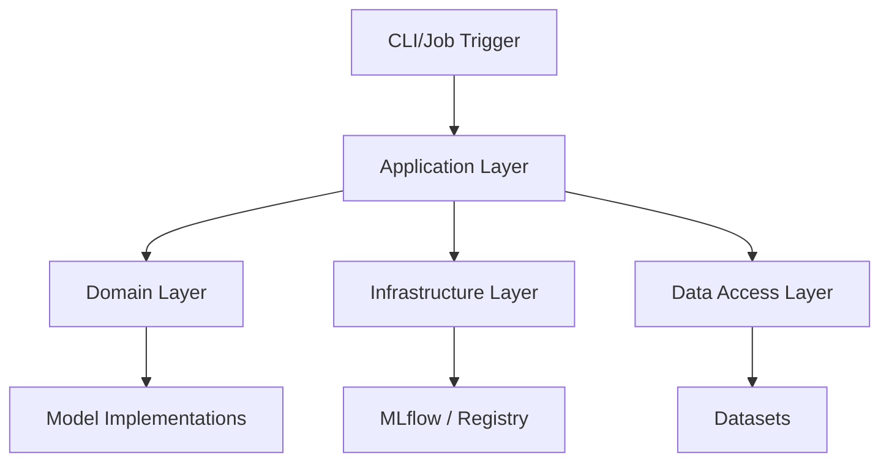

# Solution Architecture Report (SAR): LLMOps Autogen Team

## 1. Architectural Style

The project follows **Domain-Driven Design (DDD)** and **Onion Architecture** to ensure modularity and maintainability.

## 2. REPOSITORY STRUCTURE & LINKS

> [!IMPORTANT]
> Map the repository layers to the architecture.

- **Root Directory**: [Root](file:///mnt/F024B17C24B145FE/Repos/llmops-python-package)
- **Application Layer**: [Application](file:///mnt/F024B17C24B145FE/Repos/llmops-python-package/src/autogen_team/application) -> Coordinators and Use Cases.
- **Domain Layer**: [Domain](file:///mnt/F024B17C24B145FE/Repos/llmops-python-package/src/autogen_team/models) -> Business Logic and Entities.
- **Infrastructure Layer**: [Infrastructure](file:///mnt/F024B17C24B145FE/Repos/llmops-python-package/src/autogen_team/infrastructure) -> Technical concerns and External Adapters.
- **Data Access Layer**: [Data Access](file:///mnt/F024B17C24B145FE/Repos/llmops-python-package/src/autogen_team/data_access) -> Persistence and Datasets.

## 3. Layer Detail

### 3.1 Domain Layer

- **Entities**: Autogen Models, Metrics, Schemas.
- **Value Objects**: Model Configurations, Evaluation Results.
- **Domain Services**: Registry Services, Model Promotion Logic.

### 3.2 Application Layer

- **Jobs/Use Cases**: TrainingJob, InferenceJob, EvaluationJob, TuningJob.
- **DTOs**: Job Contexts, Request/Response schemas.

### 3.3 Infrastructure Layer

- **External Services**: MLflow (for tracking and registry), Kafka (optional messaging).
- **Adapters**: Searchers, Splitters, Signers.

### 3.4 Data Access Layer

- **Repositories**: DatasetRepository, RegistryRepository.
- **Datasets**: Training data, Evaluation sets.

## 4. LLM Component Interactions

- **Vector Database**: N/A (Project focused on model lifecycle)
- **LLM Provider**: Autogen (Microsoft)
- **Embedding Model**: N/A

## 5. Design Diagrams

> [!TIP]
> Use Mermaid for dynamic diagrams.

---

_Template generated for Agentic workflows._
