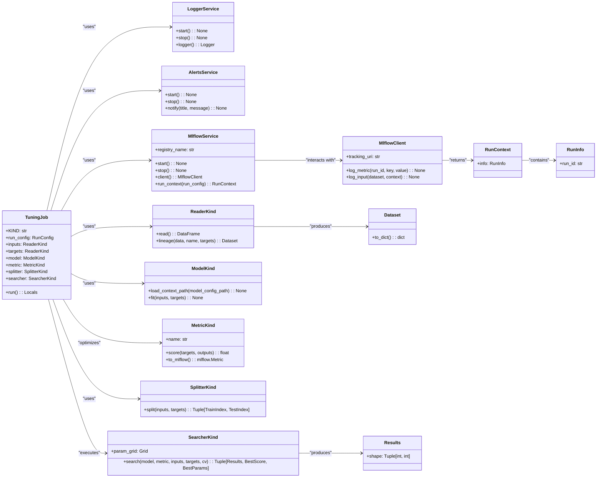

# US [Model Tuning Job](./backlog_mlops_regresion.md) : Define a job for finding the best hyperparameters for a model

- [US Model Tuning Job : Define a job for finding the best hyperparameters for a model](#us-model-tuning-job--define-a-job-for-finding-the-best-hyperparameters-for-a-model)
  - [classes relations](#classes-relations)
  - [**User Stories: Tuning Job Management**](#user-stories-tuning-job-management)
    - [**1. User Story: Configure Tuning Job**](#1-user-story-configure-tuning-job)
    - [**2. User Story: Read Input and Target Data**](#2-user-story-read-input-and-target-data)
    - [**3. User Story: Log Data Lineage**](#3-user-story-log-data-lineage)
    - [**4. User Story: Load Model From Config**](#4-user-story-load-model-from-config)
    - [**5. User Story: Execute Hyperparameter Search**](#5-user-story-execute-hyperparameter-search)
    - [**6. User Story: Identify Best Hyperparameters**](#6-user-story-identify-best-hyperparameters)
    - [**7. User Story: Notify Completion of Tuning**](#7-user-story-notify-completion-of-tuning)
    - [**Common Acceptance Criteria**](#common-acceptance-criteria)
    - [**Definition of Done (DoD):**](#definition-of-done-dod)
  - [Code location](#code-location)
  - [Test location](#test-location)

------------

## classes relations

## **User Stories: Tuning Job Management**

---

### **1. User Story: Configure Tuning Job**

**Title:**
As a **data scientist**, I want to configure a tuning job with the required parameters for hyperparameter optimization, so that I can effectively manage the hyperparameter tuning process.

**Description:**
The `TuningJob` class allows the setup of parameters such as input data readers, target data readers, the model to be tuned, the metric to be optimized, and the hyperparameter search strategy.

**Acceptance Criteria:**
- The job can be initialized with all the necessary parameters.
- Default values are properly configured for optional parameters.
- The following configurations are available:
  - Name: Name of the metric
  - Kind: Kind has to be `"TuningJob"`

---

### **2. User Story: Read Input and Target Data**

**Title:**
As a **data engineer**, I want to read input and target datasets from specified sources, so that I can prepare them for hyperparameter tuning.

**Description:**
In the `run` method, input and target data are read using the designated data readers, and the integrity of this data is validated.

**Acceptance Criteria:**
- The job successfully reads and validates input and target datasets.
- The shapes of the datasets are logged for monitoring purposes.

---

### **3. User Story: Log Data Lineage**

**Title:**
As a **compliance officer**, I want to log the lineage of input and target datasets used in the tuning job, so that we are able to trace the data in model tuning for auditing.

**Description:**
Lineage information for both the input and target datasets is logged using MLflow to provide visibility into the data utilized during hyperparameter tuning.

**Acceptance Criteria:**
- The lineage of both the input and target datasets is successfully logged in MLflow.
- Logged lineage includes necessary details to trace back the data source.

---

### **4. User Story: Load Model From Config**

**Title:**
As a **Data Scientist**, I want to load the Model from a config in the Tuning Job, so the code is more reusable.

**Description:**
The load context method is called and sets the model before the training job, so the config parameters are loaded on the run.

**Acceptance Criteria:**
-The load_context_path method of the model is called.

---

### **5. User Story: Execute Hyperparameter Search**

**Title:**
As a **data scientist**, I want to execute a hyperparameter search using the specified searcher, so that I can find the best hyperparameters for the model.

**Description:**
The job invokes the hyperparameter searcher to find optimal hyperparameters based on evaluation against the provided metric.

**Acceptance Criteria:**
- The hyperparameter search is performed successfully using the configured searcher.
- Results from the search, including performance metrics, should be logged.

---

### **6. User Story: Identify Best Hyperparameters**

**Title:**
As a **data scientist**, I want to identify the best hyperparameters as part of the tuning process, so that I can use them for model training.

**Description:**
The results of the hyperparameter search should include the best score and best parameters, which are then logged.

**Acceptance Criteria:**
- The job captures and logs the best hyperparameters found and the associated performance score.
- This information should be available for review and future reference.

---

### **7. User Story: Notify Completion of Tuning**

**Title:**
As a **user**, I want to receive a notification when the tuning job is finished, so that I can review the tuning results promptly.

**Description:**
At the conclusion of the job execution, the tuning job sends a notification detailing the completion of the process and the best score achieved.

**Acceptance Criteria:**
- Notifications include information about the best hyperparameter score.
- The alerts service successfully communicates the tuning job's completion.

---

### **Common Acceptance Criteria**

1. **Implementation Requirements:**
   - The `TuningJob` class correctly implements the abstract `run` method from the base `Job` class.
   - All necessary services (logging, MLflow, alerts) are properly initialized.

2. **Error Handling:**
   - Clear error messages should be logged for any issues encountered during data reading, hyperparameter tuning, or logging steps.

3. **Testing:**
   - Unit tests validate job setup, data reading, hyperparameter search execution, and notification delivery.
   - Tests ensure effective handling of edge cases and error scenarios.

4. **Documentation:**
   - Each class and method should have comprehensive docstrings explaining their functionality.
   - Clear examples should be provided to guide users in configuring and utilizing the tuning job.

---

### **Definition of Done (DoD):**

- The `TuningJob` class is fully implemented and operational as per the acceptance criteria.
- All functionalities are tested for accuracy and reliability.
- Documentation is complete, providing clear guidance for users.

## Code location

[src/autogen_team/jobs/tuning.py](../src/autogen_team/jobs/tuning.py)

## Test location

[tests/jobs/test_tuning.py](../tests/jobs/test_tuning.py)